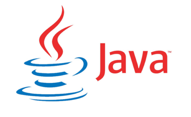

# Основы Java программирования

### Программа курса

1. [Введение в Java. Установка окружения. Запуск первой программы](./unit_01/README.md)
2. [Типы данных. Переменные. Операторы](./unit_02/README.md)
3. [Операторы управления и принятия решений](./unit_03/README.md)
4. [Циклы](./unit_04/README.md)
5. [Массивы](./unit_05/README.md)
6. [Введение в ООП. Классы и объекты](./unit_06/README.md)
7. [Строки. Регулярные выражения](./unit_07/README.md)
8. [Наследование и полиморфизм. Внутренние классы](./unit_08/README.md)
9. [Перечисляемые типы. Дженерики](./unit_09/README.md)
10. [Коллекции. Интерфейсы List, Set, Map](./unit_10/README.md)
11. [Исключения](./unit_11/README.md)
12. [Потоки ввода-вывода. Работа с файлами](./unit_12/README.md)
13. [Lambdas, Streams API](./unit_13/README.md)
14. [Многопоточность. Класс Thread и Интерфейс Runnable](./unit_14/README.md)
15. [Пулы потоков. Асинхронные вычисления](./unit_15/README.md)
16. [Взаимодействие потоков. Producer-consumer](./unit_16/README.md)
17. [Date Time API](./unit_17/README.md)
18. [Принципы дизайна ПО. SOLID. Паттерны](./unit_18/README.md)
19. [Reflection API. Аннотации](./unit_19/README.md)

---

### [Домашние задания](./homework/README.md)