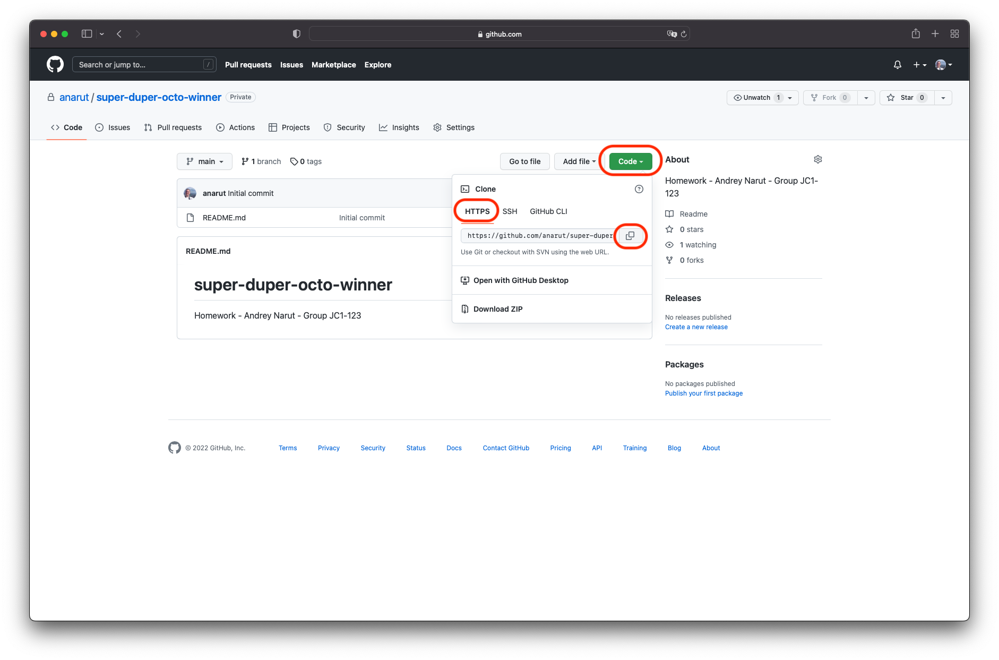

# Пошаговая инструкция как пользоваться GIT/GitLab сервисом

- [Установка GIT](#Установка-GIT)
- [Создание репозитория](#Создание-репозитория)
- [Добавление других пользователей в репозиторий](#Добавление-других-пользователей-в-репозиторий)
- [Синхронизация удаленного репозитория в IDEA](#Синхронизация-удаленного-репозитория-в-IDEA)
- [Добавление и отправка кода в удаленный репозиторий](#Добавление-и-отправка-кода-в-удаленный-репозиторий)

---

### Установка GIT

Для начала нужно установить [Git](https://git-scm.com/downloads) на компьютер

---

### Создание репозитория

Нажимаем вверху `+` и выбираем `new repository`.

 - Задаем название репозиторию
 - Можно задать небольшое описание
 - Выбираем создать `private` репозиторий
 - Выбираем пункт `Add a README file`

После того как выполнили шаги выше нажимаем `Create repository`

Поздравляю вы создали свой первый репозиторий. :+1::+1::+1:

Для дальнейших пунктов вам понадобится ссылка на ваш репозиторий. 
Ее можно найти нажав кнопку `Code` и выбрать `HTTPS`.
Нажмите кнопку копирования, чтобы скопировать ссылку в буфер обмена.

---

### Добавление других пользователей в репозиторий

Для добавления пользователя выберите вкладку `Settings` и внутри пункт `Collaborators`.
Нажмите кнопку `Add people`. 

Введите email или username пользователя.
Чтобы найти меня, введите `anarut` и выберите мой профиль в выпадающем меню.

Затем нажмите `Add anarut to this repository`.

Если все сделали правильно, я должен появиться в таблице управления доступом

---

# Синхронизация удаленного репозитория в IDEA

Открываем Intellij IDEA и выбираем пункт `Get from VCS`.

`VCS` (Version Control System) - система контроля версий. `GIT` является одной из таких программ.

Вставляем ссылку вашего репозитория в поле `URL`.
В поле ниже указываем директорию на вашем компьютере вы собираетесь хранить файлы.
После того как указали данные поля нажимаем кнопу `Clone`.

В следующем окне вам предложат залогиниться в GitHub.
Я предпочел использовать токен.
Вы можете использовать и другой вариант если хотите - дальнейшие шаги логина придется пройти самому.
Нажимаем `Use Token...`

Для того чтобы сгенерировать новый токен нажимаем `Generate...`.

Дайте название вашему токену в поле `Note`. 
Выставьте окончание действия ключа в поле `Expiration`.
Выберите `No expiration`, чтобы потом его не менять во время курса.
Поставьте все галочки в секции `Select scopes` чтобы наделить ваш токен правами.

После того как выбрали все поля, нажимаем `Generate token`.

Копируем наш токен в буфер обмена и возвращаемся в IDEA.

Вставляем токен в поле `Token`.
Нажимаем кнопку `Add Account`.

Если у вас открылся проект, поздравляю вы смогли синхронизировать удаленный репозиторий в IDEA. :+1::+1::+1:

---

### Добавление и отправка кода в удаленный репозиторий

Чтобы добавить домашние задания в репозиторий, для начала его нужно подготовить.
Создаем папку `src` и маркируем ее как `Sources Root`.

При добавлении новых файлов теперь будет выскакивать всплывающее окно, которое будет предлагать добавить файл в репозиторий.
Если не хотите каждый раз нажимать `Add`, можно выбрать пункт `Don't ask again`.

Внутри папки `src` создаем 2 пакета - `credit` (для заданий на зачет) и `exam` (для заданий на оценку) для размещения домашних заданий соответственно.
На изображении ниже показан пример размещения домашних заданий.
Если в задании требуется создать несколько классов - смотрите пример `credit` -> `ex7`.
Старайтесь давать названия классам такие, чтобы было понятно что за задание.

в корне проекта создайте файл `.gitignore` и укажите папки `.idea`, `out` чтобы они не попали под VCS.
Напоминаю, что в папке `.idea` хранятся настройки IDEA, a в папке `out` - ваш откомпилированный код.
Желательно эту информацию не добавлять в репозиторий.

После того как будете готовы отправить код в удаленный репозиторий.
Нажмите кнопку коммита (:white_check_mark:).

В диалоговом меню выберите все файлы которые хотите отправить.
Введите обязательно commit message.
Затем выберите в выпадающем меню кнопки пункт `Commit and Push...`.

В следующем окне нажимаем кнопку `Push`.

Пройдите обратно в GitHub и проверьте, что ваши файлы появились в репозитории.

---

### [Назад на главную страницу](../README.md)