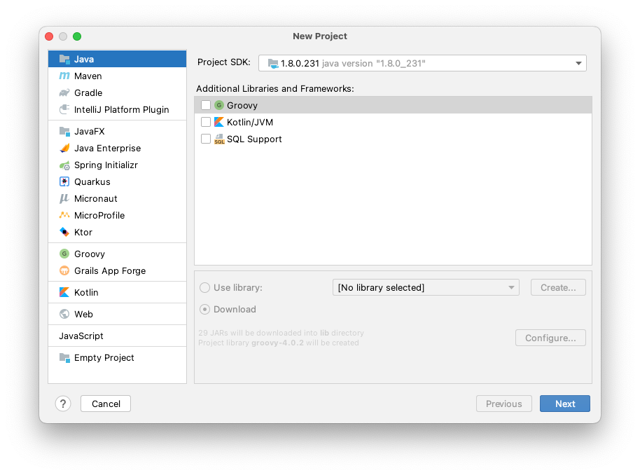
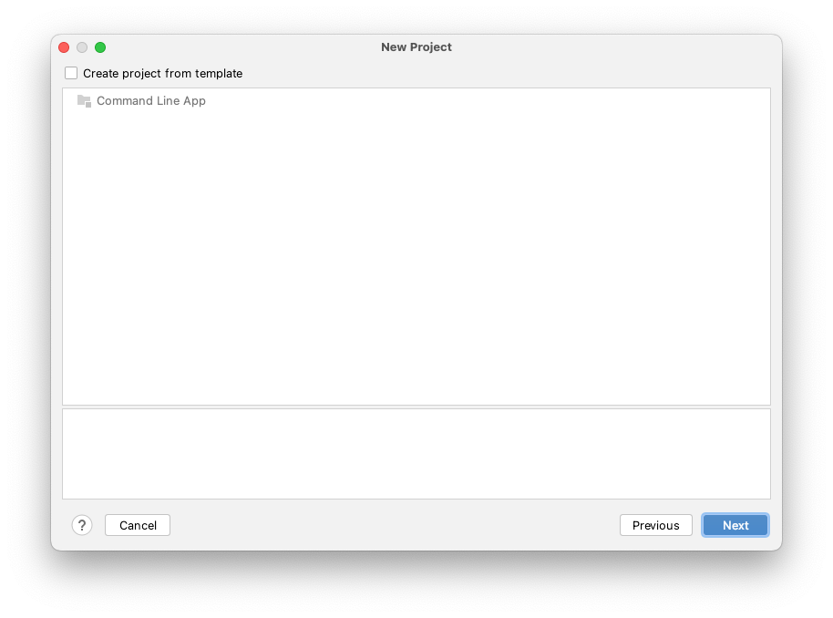
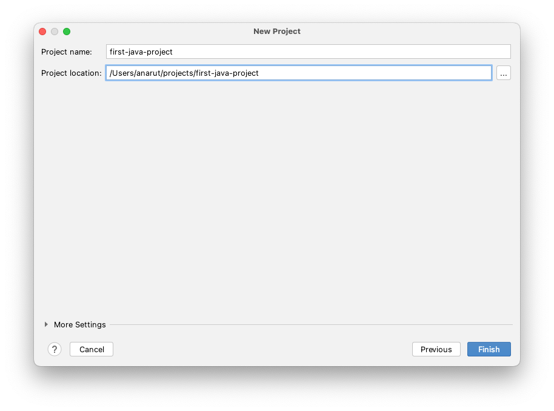
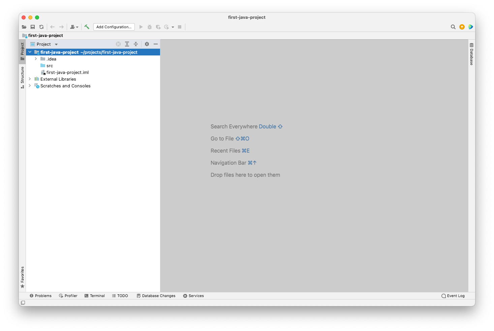
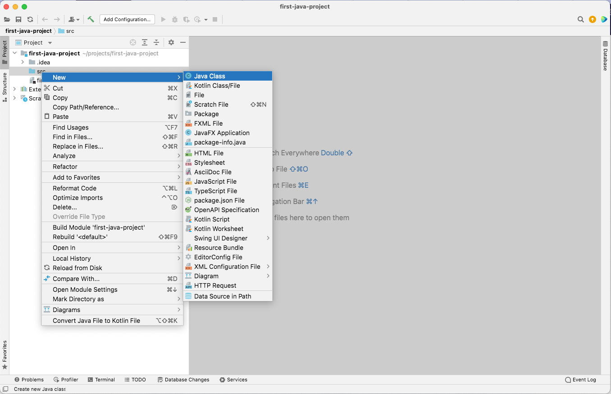
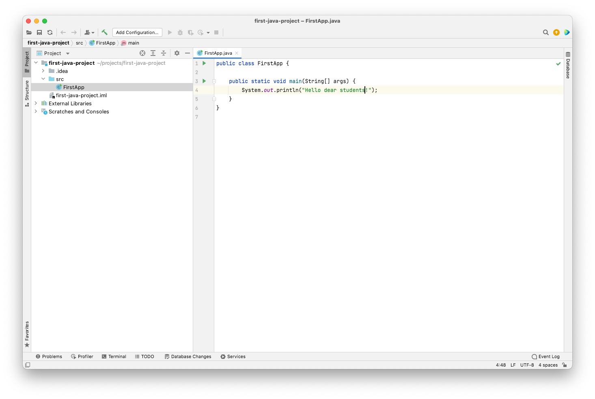
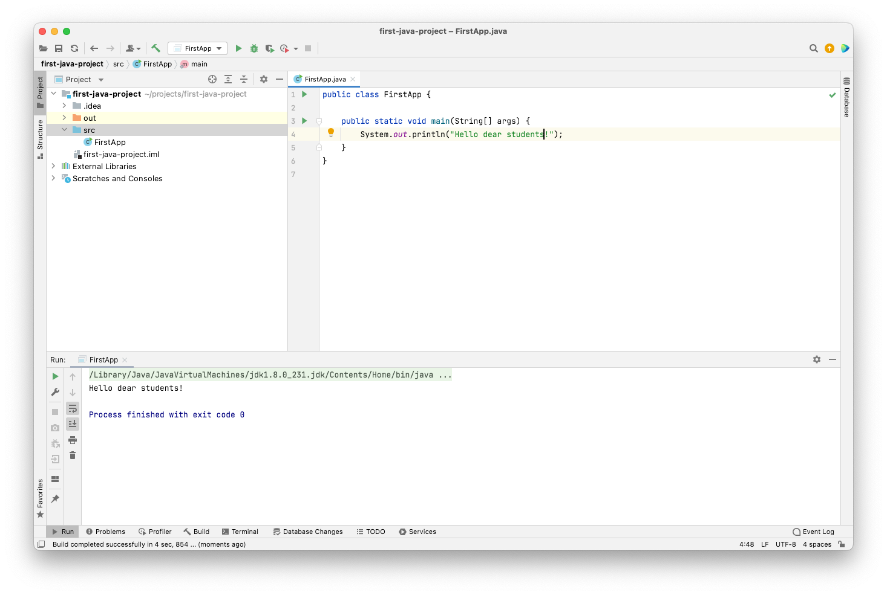

# Запуск первой программы

После установки окружения можно приступить к написанию первой программы.
Для этого запускаем IDE и создаем новый проект.

В данном окне можно тип Java проекта и его настройки.
Выбираем пункт `Java`, затем Project SDK и нажимаем далее.

В данном окне можно создать проект по шаблону. Ничего не выбираем и нажимаем далее.

В данном окне IDE предлагает назвать проект и указать путь к нему на файловой системе.
После того как указали название и путь, нажимаем далее

Первый Java проект создан! :muscle:

Слева находится каталог проекта. 
В папке `.idea` находятся настройки IDE. Старайтесь ее не трогать и ничего в ней самому не менять.
В папке `src` будет находиться java код.
Она выделена синим цветом.
Если вдруг синий цвет пропал, нажмите на нее правой кнопкой мыши и выберите `Mark Directory As` -> `Sources Root`.

Создадим нашу первую программу.
Для этого кликнем правой кнопкой мыши по папке `src` и создадим новый Java класс

Для того, что бы программу запустить нужна точка входа.
В Java это метод `public static void main(String[] args) { ... }`
Добавьте этот метод и запустите программу (зеленая кнопка слева на панели с кодом)

Первая Java программа скомпилирована (можно увидеть в каталоге проекта папку `out`) и запущена. :+1::+1::+1:
Результат выполнения программы можно увидеть на нижней панели.

---

### [Назад к оглавлению](./README.md)