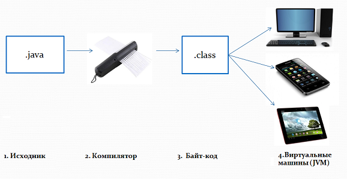

# Введение в Java

- [История и факты](#Немного-истории-и-фактов-языка)
- [Особенности языка](#Особенности-языка-Java)
- [Инструменты разработки и выполнения кода](#Инструменты-разработки-и-выполнения-Java-кода)
- [Классификация платформ](#Классификация-платформ-Java)
- [Какая разница между версиями?](#Какая-разница-между-версиями-Java?)
- [Типы версий](#Какие-бывают-типы-версий?)
- [Применение](#Где-применяется-Java?)
- [Достоинства и недостатки](#Достоинства-и-недостатки-языка-Java)

---

### Немного истории и фактов языка

- История создания языка _Java_ начинается в июне 1991 года
- Язык _Java_ разработан компанией [Sun Microsystems](https://ru.wikipedia.org/wiki/Sun_Microsystems)
- Создателем которого был _Джеймс Гослинг_
- Первоначальные названия - _Oak_ (до 1995), после _Green_ и позже был переименован как _Java_
- Первый официальный выпуск Java `«Java 1.0 (J2SE)»` состоялся 23 мая 1995 года
- Позже приобретён компанией [Oracle](https://ru.wikipedia.org/wiki/Oracle) 27 января 2010
- Знаменитый слоган **«Write once, run anywhere»** (_напиши один раз, запускай везде_)
- На данный момент _Java-приложения_ работают более чем на 7 миллиардах устройств
- Последняя версия - _Java 18_ (Март 2022)
- Маскот - Duke

---

### Особенности языка Java

- **Объектно-ориентированный**

    в Java все является объектом. Дополнение может быть легко расширено, что позволяет решить задачи по построению крупных,
    но в тоже время гибких, масштабируемых и расширяемых приложений

- **Простой**

    процессы изучения и введение в язык программирования Java остаются простыми если вы понимаете основные концепции ООП,
    то он будет прост в освоении

- **Платформо-независимый**

    в отличие от многих других языков, включая C и C++, приложения Java обычно транслируются в специальный байт-код,
    который выполняет виртуальная машина Java

- **Виртуальная машина Java (Java Virtual Machine, JVM)**

    для каждой из платформ своя реализация JVM, но каждая из них может выполнять один и тот же код

- **Автоматическая сборка мусора**

    не надо освобождать вручную память от ранее использовавшихся объектов

- **Многопоточный**

    можно писать программы, которые могут выполнять множество задач одновременно,
    что позволяет разработчикам создавать отлаженные интерактивные приложения

- **Высокопроизводительный**

    введение Just-In-Time компилятора, позволило получить высокую производительность

- **Безопасный**

    методы проверки подлинности основаны на шифровании с открытым ключом

- **Архитектурно-нейтральный и портативный**

    компилятор генерирует архитектурно-нейтральные объекты формата файла,
    что делает скомпилированный код исполняемым на многих процессорах и не имеющий зависимости от реализации аспектов спецификаций

---

### Инструменты разработки и выполнения Java кода

Прежде всего понадобится ряд инструментов, без которых написание, компиляция и исполнение программ просто невозможны:

- `JVM` виртуальная машина Java (_Java Virtual Machine_)

  Абстрактная вычислительная машина, в арсенале которой есть свой набор команд и система управления памятью. 
  JVM является основной частью исполняющей системы. 
  Обеспечивает платформо-независимый способ исполнения кода, что позволяет программистам писать код не задумываясь, как и где он будет выполняться.
  
  _Основные Задачи_: загрузка, проверка и выполнение кода

  

- `JRE` исполнительная система Java (_Java Runtime Environment_)

  Минимальная реализация виртуальной машины, необходимая для исполнения Java программ. 
  Не имеет компилятора и других средств разработки. 
  Состоит из виртуальной машины и библиотек Java классов. 

- `JDK` пакет инструментов разработчика (_Java Development Kit_)

  Комплект разработчика приложений на языке Java. 
  Включает в себя компилятор, стандартные библиотеки классов Java, примеры, документацию, различные утилиты и исполнительную систему JRE. 
  Является бесплатным и находится в свободном доступе от компании Oracle.

---

### Классификация платформ Java

- `Java SE` — Java Standard Edition, основное издание Java, содержит компиляторы, API, Java Runtime Environment,
    подходит для создания пользовательских приложений, в первую очередь — для настольных систем
- `Java EE` — Java Enterprise Edition, представляет собой набор спецификаций для создания программного обеспечения уровня предприятия
- `Java ME` — Java Micro Edition, создана для использования в устройствах, ограниченных по вычислительной мощности,
    например, в мобильных телефонах, КПК, встроенных системах
- `Java Card` — технология предоставляет безопасную среду для приложений,
    работающих на smart-картах и других устройствах с очень ограниченным объёмом памяти и возможностями обработки

---

### Какая разница между версиями Java?

Java особенная в этом отношении, поскольку она обратно совместима. 
Это означает, что ваша программа на Java 5 или 8 гарантированно будет работать с виртуальной машиной Java версии выше.
Есть некоторые исключения, но сейчас о них не нужно беспокоиться.

Но это не работает наоборот. Например, ваша программа использует функции Java 13, которые просто недоступны в Java 8.

Это означает, что вам нужно получить хорошую основу языковых возможностей вплоть до Java 8 или 11.
И только затем можно изучить дополнительные функции, которые появились в более поздних версиях Java, чтобы использовать их, когда это возможно.

---

### Какие бывают типы версий?

Типы версий Java можно разделить на 2 вида по типу поддержки:

- `STS release` или `non-LTS release` (стандартный выпуск)

  Поддерживается до выхода новой версии, приблизительно пол года. Не имеет расширенной поддержки.
  
  Примеры: Java **9**, **10**, **12**, **13**, **14**, **15**, **16**, **18**

- `LTS release` (выпуск с долгосрочной поддержкой)

  Поддерживается продолжительное количество времени, приблизительно 5-8 лет. 
  Поддержка может быть расширена еще на несколько лет. 
  В некоторых компаниях действуют политики, позволяющие использовать только _LTS_ версии.

  Примеры: Java **7** (8 лет), **8** (8 лет), **11** (5 лет), **17** (5+ лет)

На данный момент **Java 17** является последней _LTS версией_, релиз которой состоялся в сентябре 2021 

Самой последней версией является **Java 18**, релиз которой состоялся в марте 2022

---

### Где применяется Java?

- **Серверные приложения**  
  - Amazon
  - Google
  - Netflix
  - Spotify
  - Uber
  - Deutsche Bank
  - Barclays
- **Web-приложения**  
  - LinkedIn
  - AliExpress
  - eBay
  - JIRA
- **Android приложения**  
  - все приложения с использованием Google и Android API
- **Десктопные приложения**   
  - IntelliJ IDEA
  - Eclipse
  - Netbeans IDE
  - jEdit
- **Трейдинговые приложения**
  - LMAX
  - Murex
- **Встраиваемые системы**
  - smart-карты
  - сенсоры
  - банковские карты
- **Игры**
  - Minecraft
  - SimCity
  - Worms: A Space Oddity
  - Saint Row 2 (Mobile)

---

### Достоинства и недостатки языка Java

- :thumbsdown: Небольшой набор синтаксического сахара и инструментов
- :thumbsdown: Время разработки
- :thumbsdown: Громоздкость кода
- :thumbsdown: Developer Experience (DX)

- :thumbsup: Быстродействие
- :thumbsup: Комьюнити
- :thumbsup: Фреймворки с большим спектром инструментов для решения различных задач
- :thumbsup: Удобный инструмент для отладки кода - debugging
- :thumbsup: Легко изучать код и читать документацию
- :thumbsup: Огромное количество проектов различной сложности
- :thumbsup: Постоянная нехватка Java разработчиков

---

### [Назад к оглавлению](./README.md)