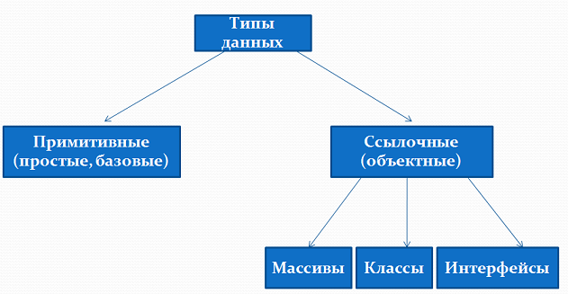
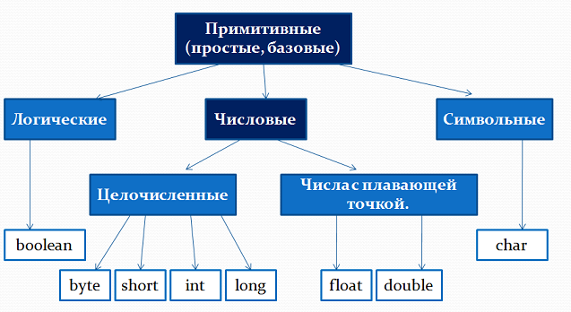
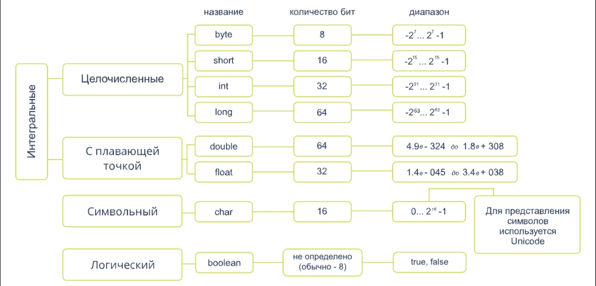

# Типы данных

- [Какие типы данных есть в Java?](#Какие-типы-данных-есть-в-Java?)
- [Примитивные типы данных](#Примитивные-типы-данных)
  - [Целочисленные типы](#Целочисленные-типы)
  - [Числа с плавающей точкой](#Числа-с-плавающей-точкой)
  - [Символьные типы](#Символьные-типы)
  - [Логические типы](#Логические-типы)
- [Детальная схема примитивных типов](#Детальная-схема-примитивных-типов)
- [Ссылочные типы данных](#Ссылочные-типы-данных)
- [Литералы](#Литералы)
- [Экранирование символов](#Экранирование-символов)
---

### Какие типы данных есть в Java?

Одной из основных особенностей Java является то, что данный язык является _строго типизированным_.
А это значит, что каждая переменная и константа представляет определенный тип и данный тип строго определен.
Тип данных определяет диапазон значений, которые может хранить переменная или константа.

##### Существует два типа данных в Java:

- простые или примитивные типы данных
- ссылочные или объектные типы данных



---

### Примитивные типы данных

Существует восемь примитивных типов данных, поддерживаемых Java.
Основные типы данных предопределены языком и названы по [ключевому слову](keywords.md). 

Рассмотрим в деталях все восемь базовых типов данных существующих в языке программирования Java.



---

### Целочисленные типы

#### byte

- Размер: 1 байт (или 8 бит)
- Минимальное значение: `-128` (-2<sup>7</sup>)
- Максимальное значение: `127` (2<sup>7</sup>-1)
- Значение по умолчанию – `0`
- предназначен для экономии места в больших массивах вместо целых чисел, поскольку `byte` в четыре раза меньше, чем `int`

Пример:

```java
public class Main {
    public static void main(String[] args) {
        byte a = 61;
        byte b = -45;
        byte c = 99;
    }
}
```

#### short

- Размер: 2 байта (или 16 бит)
- Минимальное значение: `-32 768` (-2<sup>15</sup>)
- Максимальное значение: `32 767`  (2<sup>15</sup>-1)
- Значение по умолчанию — `0`
- Используется для экономии памяти так же как и `byte`. 
  Размер `short` в 2 раза меньше, чем `int`

Пример:

```java
public class Main {
    public static void main(String[] args) {
        // "_" можно использовать нижнее подчеркивание для улучшения чтения
        short d = 12_345;
        short e = -23_456;
        short f = 16;
        short val = 32323;
    }
}
```

#### int

- Размер: 4 байта (или 32 бита)
- Минимальное значение: `-2 147 483 648` (-2<sup>31</sup>)
- Максимальное значение: `2 147 483 647` (2<sup>31</sup>-1)
- Значение по умолчанию — `0`
- Используется для целых значений если нет ограничений по поводу памяти

Пример:

```java
public class Main {
    public static void main(String[] args) {
        int g = 100_000;
        int h = -1_234_567;
        int i = 3_454_756_856;
        int j = -2_003_540;
    }
}
```

#### long

- Размер: 8 байт (или 64 бита)
- Минимальное значение: `-9 223 372 036 854 775 808` (-2<sup>63</sup>)
- Максимальное значение: `9 223 372 036 854 775 807` (2<sup>63</sup>-1)
- Значение по умолчанию — `0L`
- Применяется, когда требуется более широкий диапазон, чем `int`

Пример:

```java
public class Main {
    public static void main(String[] args) {
        long k = 100_000;
        // Все числа по умолчанию являются int. Поэтому добавляем в конце числа L, чтобы явно указать что это Long
        long l = 111_234_567_890L;
        long m = -653;
        // Можно использовать l, но она похожа на 1. Лучше использовать L
        long n = 654_573_78l;
    }
}
```

---

### Числа с плавающей точкой

Слово «плавающая» означает, что десятичная точка может располагаться в любом месте (она «плавает»).
Число представляет собой мантиссу (набор чисел) и порядок (показатель степени).
В Java используется стандарт [IEEE 754](https://ru.wikipedia.org/wiki/IEEE_754-2008) для хранения такого числа


#### float

- Размер: 4 байта (или 32 бита)
- Минимальное значение: `1.4e-45f`
- Максимальное значение: `3.4028235e+38f`
- Используется главным образом для сохранения памяти в больших массивах чисел с плавающей точкой
- Никогда не должен применяется для точного значения, например, валюты
- Значение по умолчанию — `0.0f`

Пример:

```java
public class Main {
    public static void main(String[] args) {
        float val1 = 234.5f;
        float val2 = 123_234.534_543_5F;
        float result = 17f;
    }
}
```

#### double

- Размер: 8 байт (или 64 бита)
- Минимальное значение: `4.9e-324`
- Максимальное значение: `1.7976931348623157e+308`
- Используется для десятичных значений
- Никогда не должен применяется для точного значения, например, валюты
- По умолчанию — `0.0d`

Пример:

```java
public class Main {
    public static void main(String[] args) {
        double d1 = 0.0;
        double d2 = 0.1232;
        double d3 = .666;
        double d4 = 1234.6;
    }
}
```

---

### Символьные типы

В Java для хранения символов используется кодировка [Unicode](https://ru.wikipedia.org/wiki/Юникод).
Таблицу символов Unicode можно посмотреть [здесь](https://unicode-table.com/ru/)

### char

- Размер: 2 байта (или 16 бит)
- Минимальное значение: `\u0000` (или `0`)
- Максимальное значение: `\uffff` (или `65535`)
- Нужен для хранения любого символа

Пример:

```java
public class Main {
    public static void main(String[] args) {
        char letterA ='A';
        char lowerA = 'a';

        // код переменной
        char someChar1 = 116;
        char someChar2 = 67; 
        
        //шестнадцатеричное представление символа из таблицы Unicode
        char unicodeChar = '\u0054';
    }
}
```

---

### Логические типы

#### boolean

- Размер: 1 бит
- Существует только два возможных значения: `true` и `false`
- По умолчанию — `false`
- Предназначен для простых признаков, которые позволяют отслеживать условия `true` или `false`

Пример:

```java
public class Main {
    public static void main(String[] args) {
        boolean one = true;
        boolean two = false;
        boolean three = true;
    }
}
```

---

### Детальная схема примитивных типов



---

### Ссылочные типы данных

Ссылочные типы данных ещё называют ссылками.
К ним относятся все классы, интерфейсы, массивы, а также тип данных `String`.

По умолчанию значение любой переменной ссылки - `null`

Ссылочные переменные создаются с использованием конструкторов класса.
Они предназначены для доступа к объектам.
Эти переменные объявляются с определенным типом, который не может быть изменен.

Пример:

```java
public class Main {
    public static void main(String[] args) {
        Pet pet = new Pet("Armadillo"); // объект класса Pet
        Student student = new Student("Ivan"); // объект класса Student
        
        String s = "Hello World"; // строка

        byte[] a = new byte[100]; // одномерный массив
        int[][] arr = new int[5][5]; // двумерный массив
    }
}
```

---

### Литералы

Литералы — это явно заданные значения в коде программы — константы определенного типа, которые находятся в коде в момент запуска.

Все литералы — это примитивные значения (строки, числа, символы, булевы значения).
Единственный литерал, связанный с объектами — это `null`.

Пример:

```java
public class Main {
    public static void main(String[] args) {
        // Целочисленные литералы
        int a = 0b1101110100;   // в двоичной системе (884)
        int b = 016325;         // в восьмеричной системе (7381)
        int c = 42536;          // в десятичной системе (42536)
        int d = 0x1E1D1F;       // в шестнадцатеричной системе (1973535)

        // Литералы с плавающей точкой
        float e = 123.4321F;            // в классическом виде
        float f = 1.01E-11F;            // в научном виде
        double g = 2342.71821243214;    // в классическом виде
        double e = 5.72E-17;            // в научном виде
        
        // Строковые литералы
        String s1 = "Обычная строка с текстом";
        String s2 = "Строка содержит служебные символы,\\ которые необходимо экранировать - \"escape\"";
        
        // Символьные литералы
        char c1 = ',';      // указание символа в явном виде
        char c2 = '\\';     // указание символа в явном виде
        char c3 = '\u00FF'; // указание символа в при помощи Unicode в шестнадцатеричном виде
        char c4 = '\263';   // указание символа в при помощи Unicode в восьмеричном виде
        
        // Логические литералы
        boolean yes = true;
        boolean no = false;
    }
}
```

---

### Экранирование символов

Некоторые символы нельзя использовать напрямую в строковых литералах, так как у них есть другое назначение.
Например, символ двойных кавычек `"` обозначает начало и конец строки;
одинарных кавычек `'` - начало и конец символа.
Для решения этой и подобных проблем было придумано экранировать символы.
Управляющие символы меняются на так называемые управляющие последовательности, известные как _escape-последовательности_.

Список escape-последовательностей:

- `\’` — Символ одинарной кавычки
- `\”` — Символ двойной кавычки
- `\t` — Символ табуляции
- `\n` — Символ перехода на новую строку
- `\r` — Символ возврата каретки
- `\b` — Символ возврата в тексте на один шаг назад или удаление одного символа в строке (backspace)
- `\\` — Символ обратной косой черты (\\)
- `\f` — Прогон страницы к началу следующей страницы

---

### [Назад к оглавлению](./README.md)