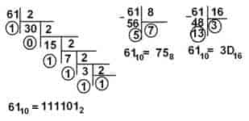
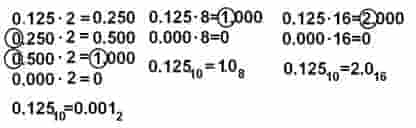

# Перевод числа в другую систему счисления

- [Перевод целой части из десятичной системы счисления](#Перевод-целой-части-из-десятичной-системы-счисления)
- [Перевод дробной части из десятичной системы счисления](#Перевод-дробной-части-из-десятичной-системы-счисления)
- [Перевод из двоичной в десятичную систему счисления](#Перевод-из-двоичной-в-десятичную-систему-счисления)
- [Перевод из восьмеричной в десятичную систему счисления](#Перевод-из-восьмеричной-в-десятичную-систему-счисления)
- [Перевод из шестнадцатеричной в десятичную систему счисления](#Перевод-из-шестнадцатеричной-в-десятичную-систему-счисления)

### Перевод целой части из десятичной системы счисления

Перевод из `2` в `8` в `16` системы счисления.

---

### Перевод дробной части из десятичной системы счисления

Перевод из `2` в `8` в `16` системы счисления.

---

### Перевод из двоичной в десятичную систему счисления

1010010.1012 = 1·26 + 0·25 + 1·24 + 0·23 + 0·22 + 1·21 + 0·20 + 1·2-1 + 0·2-2 + 1·2-3 =

= 64 + 0 + 16 + 0 + 0 + 2 + 0 + 0.5 + 0 + 0.125 = 82.62510

---

### Перевод из восьмеричной в десятичную систему счисления

108.58 = 1·82 + 0·81 + 8·80 + 5·8-1 =

= 64 + 0 + 8 + 0.625 = 72.62510

---

### Перевод из шестнадцатеричной в десятичную систему счисления

108.516 = 1·162 + 0·161 + 8·160 + 5·16-1 =

= 256 + 0 + 8 + 0.3125 = 264.312510

---

### [Назад к оглавлению](./README.md)