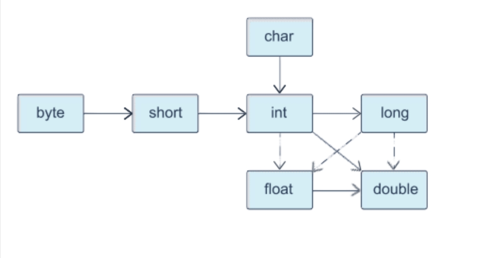

# Приведение типов

- [Основные правила приведения типов](#Основные-правила-приведения-типов)
- [Неявное приведение (расширяющее-приведение)](#Неявное-приведение-(расширяющее-приведение))
- [Явное приведение (сужающее приведение)](#Явное-приведение-(сужающее-приведение))
- [Исключительные ситуации приведения](#Исключительные-ситуации-приведения)

---

### Основные правила приведения типов

Значения любого [базового (примитивного) типа данных](./data_types.md#Таблица-примитивных-типов-данных) занимают фиксированное количество байт в памяти.
Такое хранение влияет на результат выполнения операторов с различными типами данных.
Чтобы избежать ошибки, нужно правильно определять тип переменной, в которую будет помещен результат выражения.

Существует ряд правил, которые определяют тип результирующего выражения:

- `Правило 1`
 
  Если в выражении участвуют только целочисленные литералы и/или переменные до типа `int` включительно, то результат выражения будет `int`. 
  Другими словами, даже если в выражении не будет переменных типа `int`, результат выражения все равно будет `int`.

- `Правило 2`
  
  Если в выражении есть переменная или литерал типа `long`, то результат выражения будет `long`.

- `Правило 3`
  
  Если в выражении есть переменная или литерал типа `float`, то результат выражения будет `float`.

- `Правило 4`

  Если в выражении есть переменная или литерал типа `double`, то результат выражения будет `double`.

Если в выражении используются данные различных типов, то для его выполнения необходимо привести все данные к одному типу.

Существует два вида приведения для примитивных типов:

- Неявное
- Явное

---

### Неявное приведение (расширяющее приведение)

Неявно выполняется только расширяющее приведение типов.
Оно не позволяет потерять информацию о величине числового значения.
Выполняется автоматически Java.

К расширяющему приведению примитивных типов относятся 19 конкретных преобразований:

- `byte` -> `short`, `int`, `long`, `float`, `double`
- `short` -> `int`, `long`, `float`, `double`
- `char` -> `int`, `long`, `float`, `double`
- `int` -> `long`, `float`, `double`
- `long` -> `float`, `double`
- `float` -> `double`

На следующем рисунке с помощью стрелок изображено, какие преобразования типов могут выполняться автоматически.
Пунктирные стрелки показывают автоматические преобразования с возможной потерей точности.



Пример:

```java
public class Main {
    public static void main(String[] args) {
        //Без потери точности
        byte a = 7;
        int b = a;
        System.out.println(d);

        //С потерей точности
        int c = 2_147_483_647;
        float d = c;
        System.out.println(d);
    }
}
```

Расширяющее приведение можно выполнять и явно, но не рекомендуется – необходимости в этом нет.

---

### Явное приведение (сужающее приведение)

Явно выполняется сужающее приведение типов.
При этом возможна потеря информации о величине числового значения, а также точности и диапазона.
Выполняется программистом.

К сужающему приведению примитивных типов относятся 22 конкретных преобразования:

- `short` -> `byte`, `char`
- `char` -> `byte`, `short`
- `int` -> `byte`, `short`, `char`
- `long` -> `byte`, `short`, `char`, `int`
- `float` -> `byte`, `short`, `char`, `int`, `long`
- `double` -> `byte`, `short`, `char`, `int`, `long`, `float`

Пример:

```java
public class Main {
    public static void main(String[] args) {
        int valueInt = 34_567;
        short valueShort = (short) valueInt;
        System.out.println(valueInt + " -> " + valueShort);

        double valDouble = 1.0e-46;
        float valFloat = (float) valDouble;
        System.out.println(valDouble + " -> " + valFloat);
    }
}
```

---

### Исключительные ситуации приведения

Существуют условия, когда явное приведение не требуется.
Рассмотрим такие условия:

- Литерал входит в диапазон типа переменной

```java
byte b = 35;
```

- Результат выражения входит в диапазон типа переменной

```java
final byte b1 = 5;
byte b2 = b1 + 10;
```


- Сокращенные формы операторов (`++`, `--`, `+=`, `/=`, `*/` и т.д.)

```java
byte b3 = 50;
int iVal = -100;
b3 += iVal--;
```

---

### [Назад к оглавлению](./README.md)