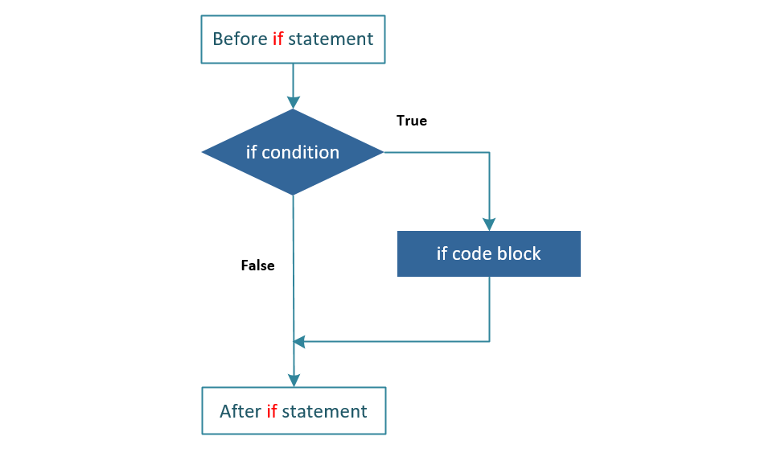
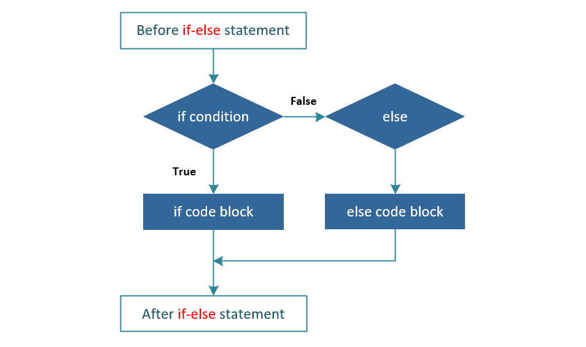
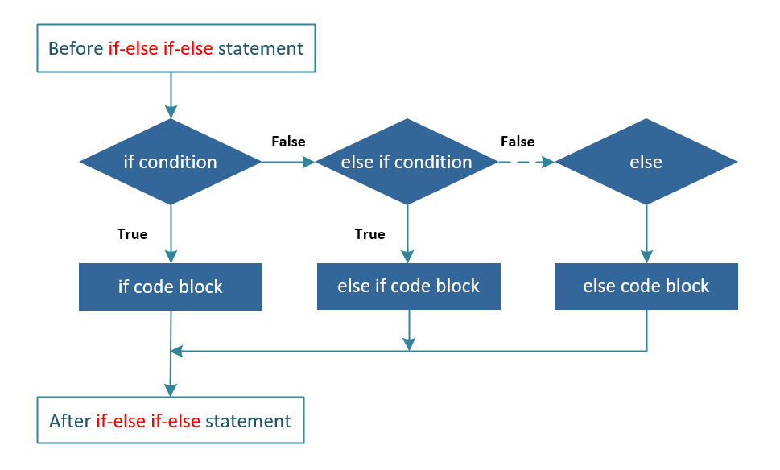

# Оператор if / if-else

Структура условного оператора состоит из одного или нескольких условий, которые проверяются в рамках программы.
Вместе с условиями определены оператор или группа операторов, которые должны быть выполнены, если условие определяется как истинно.
Так же возможны и другие оператор или группа операторов, которые будут выполняться, если условие определяется как ложно.

У условного оператора существует несколько конструкций:

- [if](#Конструкция-if)
- [if-else](#Конструкция-if-else)
- [if-else-if-else](#Конструкция-if-else-if-else)
- [вложенный if](#Конструкция-вложенный-if-или-nested-if)

Рассмотрим каждую конструкцию подробнее

---

### Конструкция if

Конструкция `if` состоит из логического выражения, после которого следует один или более операторов

Синтаксис:

```java
if(Логическое выражение)
    //Выполняется, если логическое выражение истинно
    оператор1
        
        
if(Логическое выражение) {
    //Выполняется, если логическое выражение истинно
    оператор или группа операторов
}
```



Если логическое выражение истинно, то блок кода внутри оператора `if` будет выполнен.
Если нет, то будет выполняться следующий блок кода, идущий после оператора `if` (после фигурных скобок)

Пример:

```java
public class Main {
    public static void main(String[] args) {
        int x = 10;

        if (x < 20) {
            System.out.print("x < 20");
        }
    }
}
```

---

### Конструкция if-else

Оператор `if` может сопровождаться дополнительным оператором `else`, который выполняется при ложном логическом выражении

Синтаксис:

```java
if (Логическое выражение)
    //Выполняется, если логическое выражение истинно
    оператор1
else
    //Выполняется, если логическое выражение ложно
    оператор2


if (Логическое выражение) {
    //Выполняется, если логическое выражение истинно
    оператор или группа операторов
} else {
    //Выполняется, если логическое выражение ложно
    оператор или группа операторов
}


```



Если логическое выражение истинно, то блок кода `if` будет выполнен, в противном случае, будет выполнен блок кода `else`

Пример:

```java
public class Main {
    public static void main(String[] args) {
        int x = 30;

        if (x < 20) {
            System.out.print("Это оператор if");
        } else {
            System.out.print("Это оператор else");
        }
    }
}
```

---

### Конструкция if-else-if-else

Конструкция `if-else-if-else` используется в случае, когда значение нужно проверить больше одного логического выражения.

Оператор `if` может сопровождаться дополнительным оператором `else if-else`,
который является очень полезным для тестирования различных условий с использованием одного оператора `if-else if`.

Синтаксис:

```java
if (Логическое выражение 1) {
    //Выполняется, если 1 логическое выражение истинно
    оператор или группа операторов
} else if (Логическое выражение 2) {
    //Выполняется, если 1 логическое выражение ложно и 2 логическое выражение истинно
    оператор или группа операторов
} else {
    //Выполняется, если 1 и 2 логическое выражение ложно
    оператор или группа операторов
}
```

При использовании операторов `if`, `else-if`, `else` в Java есть несколько моментов, которые необходимо иметь в виду:

- `if` может иметь ноль или один `else`, который должен идти после любого `if`
- `if` может иметь ноль для многих `else`, и он должен идти до `else`
- после того как `if-else` будет успешно выполнен, из оставшихся `else-if` или `else` ничто не будет выполнено



Пример:

```java
public class Main {
    public static void main(String args[]) {
        int x = 30;

        if (x == 10) {
            System.out.print("Значение X = 10");
        } else if (x == 20) {
            System.out.print("Значение X = 20");
        } else if (x == 30) {
            System.out.print("Значение X = 30");
        } else {
            System.out.print("Это оператор else");
        }
    }
}
```

---

### Конструкция вложенный if или nested if

В Java допустимы вложенные операторы `if-else`.
Можно использовать один оператор `if` или `if-else` внутри другого оператора `if` или `else`.

Синтаксис:

```java
if (Логическое выражение 1) {
    //Выполняется, если логическое выражение 1 истинно
    оператор или группа операторов
    if (Логическое выражение 2) {
        //Выполняется, если логическое выражение 2 истинно (и логическое выражение 1)
        оператор или группа операторов
    }
}
```

Пример:

```java
public class Main {
    public static void main(String[] args) {
        int x = 30;
        int y = 10;

        if (x == 30) {
            if (y == 10) {
                System.out.print("X = 30 и Y = 10");
            }
        }
    }
}
```

---

### [Назад к оглавлению](./README.md)