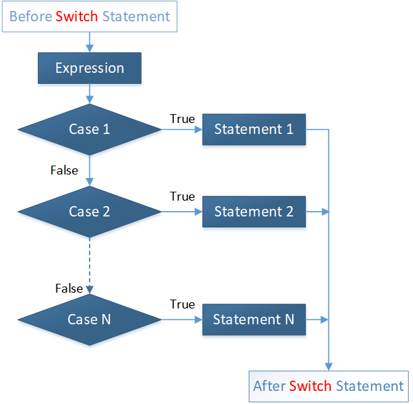

# Оператор switch-case

- [Общий вид оператора](#Общий-вид-оператора)
- [Новые возможности switch. Слово yield](#Новые-возможности-switch.-Слово-yield)
- [Лямбда выражения в switch](#Лямбда-выражения-в-switch)
- [Оператор switch как аргумент метода](#Оператор-switch-как-аргумент-метода)

---

### Общий вид оператора

Оператор `switch-case` позволяет проверить переменную сразу на несколько условий.

Синтаксис:

```
switch (выражение) {
    case значение 1:
       //Операторы
       break; //необязательно
    case значение 2:
       //Операторы
       break; //необязательно
       //Вы можете иметь любое количество операторов case.
    default : //необязательно
       //Операторы
}
```



Следующие правила применяются для оператора `switch`:

-   Переменные, которые используются в операторе `switch`, могут быть только целые числа,
    конвертированные в целые числа (`byte`, `short`, `char`), строки (`String`) и перечисления (`enum`)
-   Вы можете иметь любое количество операторов `case` в рамках одного `switch`. 
    За каждым `case` следует сравниваемое значение, а затем идёт двоеточие
-   Значение `case` должен быть того же типа данных как и переменная в `switch`, и она должна быть константой или литерал
-   Когда переменная `switch` не равна оператору `case`, операторы, следующие за `case` будут выполняться до тех пор,
    пока не будет достигнут оператор `break`
-   При достижении оператора `break`, `switch` завершается, и поток управления переходит к следующей строке после оператора **switch**
-   Не каждый `case` должен содержать `break`
    Если отсутствует `break`, поток управления попадет на следующие `case`, до тех пор пока `break` не будет достигнут
-   В Java оператор `switch` может иметь дополнительный `default case`, который должен находиться в конце `switch`.
    `Default case` может быть использован для выполнения задачи, когда ни один из case является правильным.
    `Break` не требуется в `default case`.

Пример:

```java
public class Main {
    public static void main(String[] args) {
        char grade = 'C';

        switch (grade) {
            case 'A':
                System.out.println("Отлично!");
                break;
            case 'B':
            case 'C':
                System.out.println("Отлично выполнено");
                break;
            case 'D':
                System.out.println("Вы прошли");
                break;
            case 'F':
                System.out.println("Лучше попробуйте снова");
                break;
            default:
                System.out.println("Неверная оценка");
        }
        System.out.println("Ваша оценка " + grade);
    }
}
```

---

### Новые возможности switch. Слово yield

С 12 версии у оператора `switch` появилась возможность возвращать значение.

Ранее справа от `break` у нас уже ничего не могло стоять. Сейчас его можно использовать как оператор `return` для возвращения значения нашим `switch`.

Пример:

```java
public class Main {
    public static void main(String[] args) {
        char grade = 'C';

        String text = switch (grade) {
            case 'A':
                break "Отлично!";
            case 'B':
            case 'C':
                break "Отлично выполнено";
            case 'D':
                break "Вы прошли";
            case 'F':
                break "Лучше попробуйте снова";
            default:
                break "Неверная оценка";
        };

        System.out.println(text + " Ваша оценка " + grade);
    }
}
```

:warning: :warning: :warning: Данный код будет работать только в версии Java 12

С Java 13 [зарезервированное слово](../unit_02/keywords.md) `break` было заменено на `yield`.

Пример:

```java
public class Main {
    public static void main(String[] args) {
        char grade = 'C';

        String text = switch (grade) {
            case 'A':
                yield "Отлично!";
            case 'B':
            case 'C':
                yield "Отлично выполнено";
            case 'D':
                yield "Вы прошли";
            case 'F':
                yield "Лучше попробуйте снова";
            default:
                yield "Неверная оценка";
        };

        System.out.println(text + " Ваша оценка " + grade);
    }
}
```

---

### Лямбда выражения в switch

Нововведения в Java 12 дают нам возможность использовать лямбда оператор `->`, который гарантирует выполнение кода справа от него без всякого "_проваливания_".

Пример:

```java
public class Main {
    public static void main(String[] args) {
        char grade = 'C';

        String text = switch (grade) {
            case 'A' -> "Отлично!";
            case 'B' -> "Отлично выполнено";
            case 'C' -> "Отлично выполнено";
            case 'D' -> "Вы прошли";
            case 'F' -> "Лучше попробуйте снова";
            default -> "Неверная оценка";
        };

        System.out.println(text + " Ваша оценка " + grade);
    }
}
```

Если для некоторых кейсов возвращаемое значение будет одинаковым, предусмотрен сокращенный вид.

Пример:

```java
public class Main {
    public static void main(String[] args) {
        char grade = 'C';

        String text = switch (grade) {
            case 'A' -> "Отлично!";
            case 'B', 'C' -> "Отлично выполнено"; // сокращенный вид для B и С
            case 'D' -> "Вы прошли";
            case 'F' -> "Лучше попробуйте снова";
            default -> "Неверная оценка";
        };

        System.out.println(text + " Ваша оценка " + grade);
    }
}
```

Так как это лямбда выражение, справа от оператора может использоваться блок кода.

Пример:

```java
public class Main {
    public static void main(String[] args) {
        char grade = 'C';

        switch (grade) {
            case 'A' -> {
                System.out.println("Отлично!");
                System.out.println("Так держать!");
            }
            case 'B', 'C' -> System.out.println("Отлично выполнено");
            case 'D' -> System.out.println("Вы прошли");
            case 'F' -> {
                System.out.println("Лучше попробуйте снова");
                System.out.println("Старайтесь усерднее!");
            }
            default -> System.out.println("Неверная оценка");
        }
        System.out.println("Ваша оценка " + grade);
    }


    public int defineRole(String role) {
        return switch (role) {
            case "guest" -> 0;
            case "client" -> 1;
            case "moderator" -> 2;
            case "admin" -> 3;
            default -> {
                System.out.println("non-authentic role = " + role);
                yield -1;
            }
        };
    }
}
```

---

### Оператор switch как аргумент метода

Возвращаемое значение оператора switch можно также использовать в качестве аргумента метода:

Пример:

```java
public class Main {
    public static void main(String[] args) {
        System.out.println(
                switch (value) {
                    case 2, 3, 4 -> "2,3 or 4";
                    case 777 -> "Range: " + value;
                    case 0 -> "0";
                    default -> "Default";
                });
    }
}
```

---

### [Назад к оглавлению](./README.md)