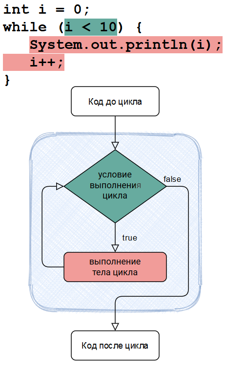
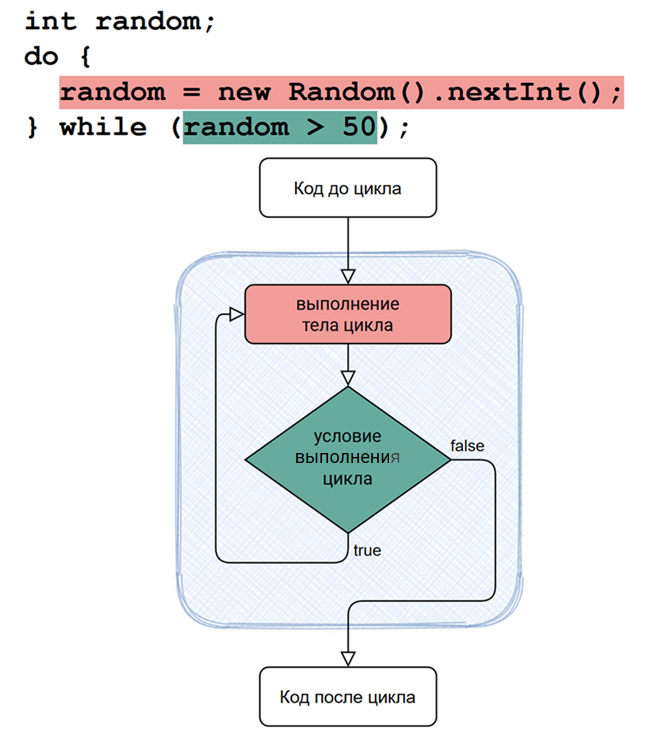
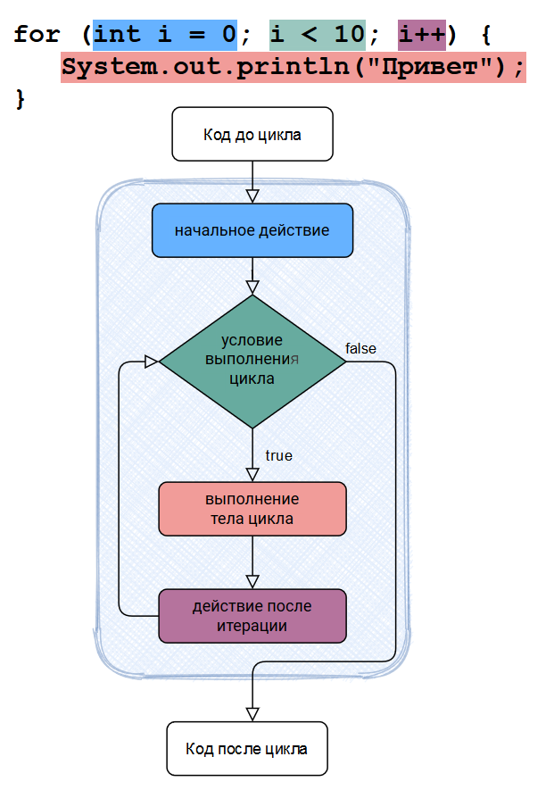
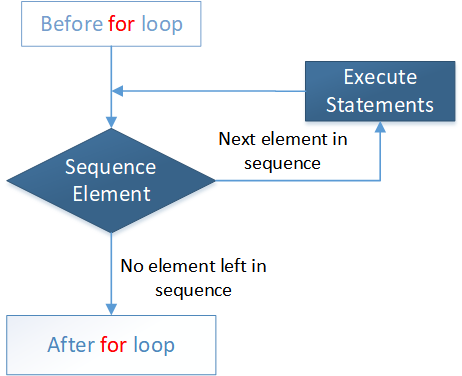

# Циклы

- [Определение цикла](#Определение-цикла)
- [Цикл while](#Цикл-while)
- [Цикл do-while](#Цикл-do-while)
- [Цикл for](#Цикл-for)
- [Цикл for-each](#Цикл-for-each)
- [Бесконечный цикл](#Бесконечный-цикл)
- [Вложенные циклы](#Вложенные-циклы)

---

### Определение цикла

**Цикл** — разновидность управляющей конструкции в высокоуровневых языках программирования, предназначенная для организации многократного исполнения набора инструкций.
Также циклом может называться любая многократно исполняемая последовательность инструкций, организованная любым способом (например, с помощью условного перехода).

Циклы позволяют выполнить оператор или группу операторов несколько раз.

Существует несколько видов циклов в Java:

- `while` [цикл с предусловием](#Цикл-while)
- `do-while` [цикл с постусловием](#Цикл-do-while)
- `for` [цикл со счетчиком](#Цикл-for)
- `for-each` [цикл по коллекции](#Цикл-for-each)
- [бесконечный цикл](#Бесконечный-цикл)

:warning: Когда выполнение цикла выходит из своей области, все объекты, которые были созданы внутри цикла, будут автоматически уничтожены.

---

### Цикл while

Цикл `while` повторяет оператор или группу операторов, пока заданное условие является `true`.
Цикл проверяет _условие_ до выполнения тела цикла.

Синтаксис:

```java
while (условие) {
    оператор или группа операторов
}
```



Пример:

```java
public class Main {

    public static void main(String[] args) {
        int x = 10;
        while (x < 15) {
            System.out.println("x= " + x);
            x++;
        }
    }
}
```

---

### Цикл do-while

Цикл `do-while` выполняется как цикл `while`, за исключением того, что он проверяет условие в конце после выполнения тела цикла.

Синтаксис:

```java
do {
    оператор или группа операторов
} while (условие);
```


Пример:

```java
public class Main {
    public static void main(String[] args) {
        int x = 10;
        do {
            System.out.println("x= " + x);
            x++;
        } while (x < 15);
    }
}
```

---

### Цикл for

Цикл `for` выполняет последовательность операторов несколько раз и сокращает код, которым управляет переменная цикла

Синтаксис:

```java
for (инициализация; условие; обновление) {
    оператор или группа операторов
}
```



Пример:

```java
public class Main {
    public static void main(String[] args) {
        for (int x = 10; x < 15; x = x + 1) {
            System.out.println("x= " + x);
        }
    }
}
```

:warning: блок _инициализации_, _условия_ или _обновления_ могут отсутствовать в цикле `for` (быть пустыми)

Пример:

```java
public class Main {
    public static void main(String[] args) {
        int x = 10;
        for (; x < 15; ) {
            System.out.println("x= " + x);
            x = x + 1;
        }
    }
}
```

---

### Цикл for-each

Цикл `for-each` является улучшенным циклом `for`.
Не требует ручного изменения переменной - шага для перебора.
Цикл автоматически выполняет эту работу

Синтаксис:

```java
for (объявление : выражение) {
    оператор или группа операторов
}
```

- `Выражение` вычисляет массив и коллекцию. Выражение может быть переменной или методом массива, вызов которого возвращает массив.
- `Объявление` переменная, через которую осуществляется доступ к элементам массива или коллекции. Имеет тип, совместимый с элементами объявленными в выражении.



Пример:

```java
public class Test {

    public static void main(String args[]) {
        int[] numbers = {10, 11, 12, 13, 14};
        for (int x : numbers) {
            System.out.println("x= " + x);
        }
    }
}
```

Во всех выше примерах будет одинаковый результат выполнения программы:

```java
х= 10
х= 11
х= 12
х= 13
х= 14
```

---

### Бесконечный цикл

Иногда в программах используются циклы, выход из которых не предусмотрен логикой программы.
Такие циклы называются _безусловными_, или _бесконечными_.

Специальных синтаксических средств для создания бесконечных циклов, ввиду их нетипичности, языки программирования не предусматривают.
Поэтому такие циклы создаются с помощью конструкций, предназначенных для создания обычных (или условных) циклов.

Пример:

```java
public class Main {
    public static void main(String[] args) {
        // Бесконечный цикл c помощью цикла while
        while (true) {
            //оператор или группа операторов
        }

        // Бесконечный цикл c помощью цикла do-while
        do {
            //оператор или группа операторов
        } while (true);

        // Бесконечный цикл c помощью цикла for
        for (; ; ) {
            //оператор или группа операторов
        }
    }
}
```

---

### Вложенные циклы

Существует возможность организовать цикл внутри тела другого цикла. Такой цикл будет называться _вложенным_.

Вложенный цикл именуется внутренним циклом.

Цикл, в теле которого существует вложенный цикл, именуется внешним циклом.

Количество уровней вложенности не ограничивается.

Пример:

```java
public class Main {
    public static void main(String[] args) {
        //результаты таблицы умножения до 5
        for (int i = 1; i <= 5; i++) {
            for (int j = 1; j <= 5; j++) {
                // Форматирование текста в printf методе. 
                // %3s обозначает что значение будет занимать 3 или более знака
                System.out.printf("%3s", i * j); 
            }
            System.out.println();
        }
    }
}
```

Результат:

```java
  1  2  3  4  5
  2  4  6  8 10
  3  6  9 12 15
  4  8 12 16 20
  5 10 15 20 25
```

---

### [Назад к оглавлению](./README.md)