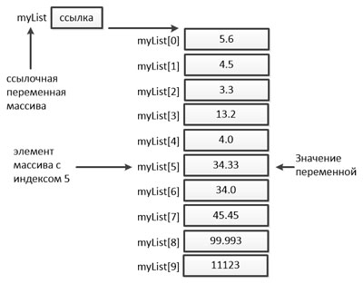

# Массивы

- [Определение](#Определение-массива)
- [Объявление](#Объявление-массива)
- [Создание](#Создание-массива)
- [Итерация](#Итерация-по-массиву)
- [Передача массива в метод](#Передача-массива-в-метод)
- [Возврат массива из метода](#Возврат-массива-из-метода)


---

### Определение массива

**Массив** — это структура данных, которая хранит упорядоченные коллекции фиксированного размера элементов нужного типа.
Массив используется для хранения коллекции данных, но часто бывает полезно думать о массиве как о совокупности переменных одного типа.

Вместо объявления отдельных переменных, таких как `number0`, `number1`, ..., и `number99`, можно объявить одну переменную массива,
например, `numbers` и используете `numbers[0]`, `numbers[1]`, ..., и `numbers[99]`, для отображения отдельных переменных.

---

### Объявление массива

Чтобы использовать массив в программе, необходимо объявить переменную для ссылки на массив и указать тип массива,
который может ссылаться на переменную.

Синтаксис:

```java
dataType[] arrayRefVar;

dataType arrayRefVar[]; // не является предпочтительным способом.
```

Стиль `dataType arrayRefVar[]` происходит из языка _C/C++_ и был принят в _Java_ для _C/C++_-программистов.
Стиль `dataType[] arrayRefVar` является предпочтительным.

Пример:

```java
public class Main {
    public static void main(String[] args) {
        double[] myList;
        double myList[]; // C/C++ стиль
        int[] numbers;
    }
}
```

---

### Создание массива

Создать массив можно с помощью оператора `new`.

Синтаксис:

```java
dataType[] arrayRefVar;
arrayRefVar = new dataType[arraySize]; // пример 1 

dataType[] arrayRefVar = new dataType[arraySize]; // пример 2
dataType[] arrayRefVar = {значение0, значение1, ..., значениеN}; // пример 3
```

Вышеуказанное объявление в _примере 1_ делает две вещи - создает массив, используя `new dataType[arraySize]` и ссылка присваивается переменной `arrayRefVar`.
Объявление переменной, создание и присвоение переменной ссылки массива могут быть объединены в одном операторе, как показано в _примерах 2_ и _3_.

- Элементы массива доступны через индекс `arrayRefVar[index]`
- Отсчет индексов ведется от `0`; то есть они начинают от `0` и до `arrayRefVar.length-1`
- `arrayRefVar.length` - длинна массива
- Если `index < 0` или `index >= array.length` то программа выбросит ошибку [IndexOutOfBoundsException](https://docs.oracle.com/javase/8/docs/api/index.html?java/lang/IndexOutOfBoundsException.html)
- Размер массива (arraySize) является `final`, потому выставить через него новый размер массива, увы, не получится
- После создания массив инициализируется значением по умолчанию для типа его элементов

Пример:

```java
public class Main {
    public static void main(String[] args) {
        double[] myList = new double[10];
    }
}
```

Оператор объявляет массив переменных `myList`, создает массив из `10` элементов типа `double` и присваивает ссылку `myList`.
На изображении можно увидеть отображение массива `myList`



---

### Итерация по массиву

Так как количество элементов определено (`array.length`), цикл `for` является наилучшим для итерации.

Пример:

```java
public class Main {
    public static void main(String[] args) {
        double[] arr = new double[10];

        // Вывод массива на экран
        for (int i = 0; i < arr.length; i++) {
            System.out.println(arr[i]);
        }
    }
}
```

Так же можно использовать цикл `for-each` или расширенный цикл `for`,
который позволяет последовательно пройти весь массив без использования индекса переменной

Пример:

```java
public class Main {
    public static void main(String[] args) {
        double[] myList = {1.9, 2.9, 3.4, 3.5};

        // Вывод массива на экран
        for (double element: myList) {
            System.out.println(element);
        }
    }
}
```

---

### Передача массива в метод

Массив можно передать в метод. Например, следующий метод отображает элементы в int массиве.

Пример:

```java
public class Main {
    public static void printArray(int[] array) {
        for (int i = 0; i < array.length; i++) {
            System.out.print(array[i] + " ");
        }
    }
}
```

---

### Возврат массива из метода

```java
public class Main {
    //реверсирование другого массива
    public static int[] reverse(int[] arr) {
        int[] result = new int[arr.length];

        for (int i = 0, j = result.length - 1; i < arr.length; i++, j--) {
            result[j] = arr[i];
        }
        return result;
    }
}
```

---

### [Назад к оглавлению](./README.md)