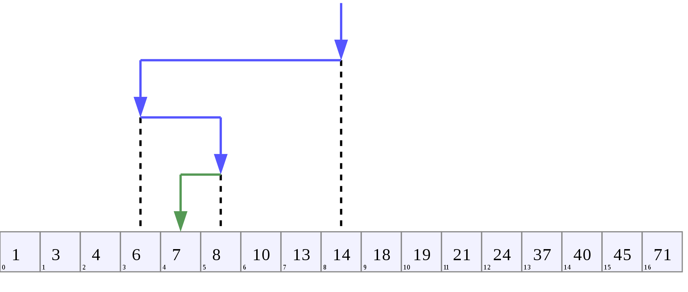

# Двоичный (бинарный) поиск

Двоичный поиск - классический алгоритм поиска элемента в отсортированном массиве, использующий дробление массива на половины.

Поиск элемента в отсортированном массиве:
- Определение значения элемента в середине структуры данных.
Полученное значение сравнивается с ключом.
- Если ключ меньше значения середины, то поиск осуществляется в первой половине элементов, иначе — во второй.
- Поиск сводится к тому, что вновь определяется значение серединного элемента в выбранной половине и сравнивается с ключом.
- Процесс продолжается до тех пор, пока не будет найден элемент со значением ключа или не станет пустым интервал для поиска.

### Визуализация алгоритма двоичного поиска - поиск числа 7:



### Итеративная реализация:

```java
public class Main {
    public int runBinarySearchIteratively(int[] sortedArray, int key, int low, int high) {
        int index = Integer.MAX_VALUE;

        while (low <= high) {
            int mid = (low + high) / 2;
            if (sortedArray[mid] < key) {
                low = mid + 1;
            } else if (sortedArray[mid] > key) {
                high = mid - 1;
            } else if (sortedArray[mid] == key) {
                index = mid;
                break;
            }
        }
        return index;
    }
}
```

---

### Рекурсивная реализация:

```java
public class Main {
    public static int runBinarySearchRecursively(int[] sortedArray, int key, int low, int high) {
        int middle = (low + high) / 2;

        if (high < low) {
            return -1;
        }

        if (key == sortedArray[middle]) {
            return middle;
        } else if (key < sortedArray[middle]) {
            return runBinarySearchRecursively(sortedArray, key, low, middle - 1);
        } else {
            return runBinarySearchRecursively(sortedArray, key, middle + 1, high);
        }
    }
}
```

---

### [Назад к оглавлению](../README.md)