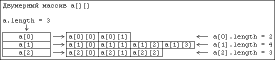

# Многомерные (n-мерные) массивы 

Начнем с двумерных массивов.

Рассмотрим данный пример:



- Его длина по первому индексу равна 3. Ее можно получить через `a.length`.
- Элементами этого массива являются ссылки на массивы с данными
- Длина каждого из этих массивов может быть получена так же через `.length`.
- Доступ к каждому из этих массивов осуществляется через его индекс – первый индекс в массиве `a`

Для многомерного массива не существует такого понятия как его размеры.
Можно определить размер массива только по первому индексу.
Причина кроется в организации массива.
Он представляет собой массив ссылок на массивы, каждый из которых содержит реальные данные.
И эти массивы могут иметь **разную** длину!

**Двумерный массив** представляет собой массив ссылок на одномерные массивы.

Стандартный способ создания двумерного массива – это использование обычной конструкции:

```java
public class Main {
    public static void main(String[] args) {
        int[][] array = new int[10][5];
    }
}
```

Эта конструкция создает двумерный массив размером `10х5`.
О размерах тут можно говорить только потому, что размер по второму индексу явно указан при инициализации.
И все строки будут длины 5, массив будет прямоугольным.

Однако, есть и другой способ. Для примера создадим массив, приведенный выше на рисунке:

```java
public class Main {
    public static void main(String[] args) {
        int[][] a = new int[3][];
        a[0] = new int[2];
        a[1] = new int[4];
        a[2] = new int[3];
    }
}
```

Обратите внимание, в строке 1 при инициализации массива **не указана** размерность по второму индексу!

Ситуация при создании массивов-строк с типом объектов в точности та же, что и для одномерных массивов.
Под ссылки на объекты выделяется память, но сами объекты не создаются

---

### Так что такое N-мерный массив?

N-мерный массив является одномерным массивом, элементами которого являются ссылки на массивы размерности `N-1`

---

### [Назад к оглавлению](./README.md)