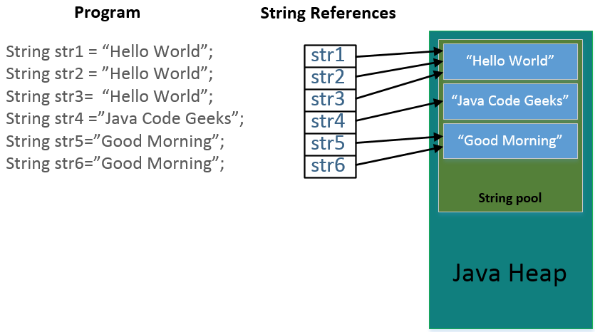

# Класс String

- [Определение](#Определение-строки-в-Java)
- [Создание](#Создание-строк)
- [Особенности](#Особенности-класса-String)
- [Пул строк](#Пул-строк-(String-pool))

---

### Определение строки в Java

**Строки** — представляют собой последовательность символов.
Строки в _Java_ широко используются и являются объектами.
Платформа _Java_ предоставляет класс строк (`String`) для создания и работы со строками.

---

### Создание строк

Наиболее простой способ создать строку:

```java
public class Main {
    public static void main(String[] args) {
        String greeting = "Hello world!";
    }
}
```

После каждого раза, когда компилятор встречает строковый литерал в коде, он создает строковый объект (`String`) со значением, в данном случае `"Hello world!"`.

Как и в случае с другими объектами, можно создавать строковые объекты, используя ключевое слово `new` и **конструктор**.
Класс строк имеет 11 конструкторов, которые позволяют обеспечить начальное значение строки, используя различные источники, таких как массив символов.

Пример:

```java
public class Main {
    public static void main(String[] args) {
        char[] helloArray = { 'H', 'e', 'l', 'l', 'o', '.' };
        String helloString = new String(helloArray);  
        System.out.println(helloString);
    }
}
```

---

### Особенности класса String

Почему String неизменная и финализированная (immutable) в Java?

- Строковый пул возможен только потому, что строка неизменна в Java, таким образом виртуальная машина сохраняет много места в памяти (`heap space`), поскольку разные строковые переменные указывают на одну переменную в пуле.
Если бы строка не была неизмененяемой, тогда бы интернирование строк не было бы возможным, потому что если какая-либо переменная изменит значение, это отразится также и на остальных переменных, ссылающихся на эту строку.

- Если строка будет изменяемой, тогда это станет серьезной угрозой безопасности приложения.
Например, имя пользователя базы данных и пароль передаются строкой для получения соединения с базой данных и в программировании сокетов реквизиты хоста и порта передаются строкой.
Так как строка неизменяемая, её значение не может быть изменено, в противном случае любой хакер может изменить значение ссылки и вызвать проблемы в безопасности приложения.

- Так как строка неизменная, она безопасна для многопоточности и один экземпляр строки может быть совместно использован различными потоками.
Это позволяет избежать синхронизации для потокобезопасности, строки полностью потокобезопасны.

- Строки используются в Java classloader и неизменность обеспечивает правильность загрузки класса при помощи `Classloader`.
К примеру, при попытке загрузить `java.sql.Connection` класс, если значение ссылки будет изменено на `hacked.Connection` класс - может осуществить нежелательные вещи с вашей базой данных.

- Поскольку строка неизменная, её hashcode кэшируется в момент создания и нет необходимости рассчитывать его снова.
Это делает строку отличным кандидатом для ключа в Map и его обработка будет быстрее, чем других ключей `HashMap`.
Это причина, почему строка наиболее часто используемый объект, используемый в качестве ключа `HashMap`.

---

### Пул строк (String pool)

`String pool` – это набор строк, который хранится в памяти `Java Heap`.
`String` это специальный класс в Java, и можно создавать объекты этого класса, используя оператор new точно так же, как и создавать объекты, предоставляя значение строки в двойных кавычках.
Диаграмма ниже объясняет, как пул строк размещается в памяти Java heap и что происходит, когда мы используем различные способы создания строк.



Пул строк возможен исключительно благодаря неизменяемости строк в Java и реализации идеи интернирования строк.
Пул строк также является примером паттерна Приспособленец (`Flyweight`).
Пул строк помогает экономить большой объем памяти, но с другой стороны создание строки занимает больше времени.

Когда при создании строки используются двойные кавычки, сначала ищется строка в пуле с таким же значением, если находится, то просто возвращается ссылка, иначе создается новая строка в пуле, а затем возвращается ссылка.
Тем не менее, когда мы используем оператор `new`, мы принуждаем класс `String` создать новый объект строки, а затем мы можем использовать метод `intern()` для того, чтобы поместить строку в пул, или получить из пула ссылку на другой объект `String` с таким же значением.

Ниже приведен пример, показывающий работу пула строк.

```java
public class StringPoolTest {
    public static void main(String[] args) {
        String s1 = "Cat";
        String s2 = "Cat";
        String s3 = new String("Cat");
        String s4 = s3.intern();

        System.out.println("s1 == s2 :" + (s1 == s2)); // true
        System.out.println("s1 == s3 :" + (s1 == s3)); // false
        System.out.println("s1 == s3 :" + (s1 == s4)); // true
    }
}
```

---

### [Назад к оглавлению](./README.md)