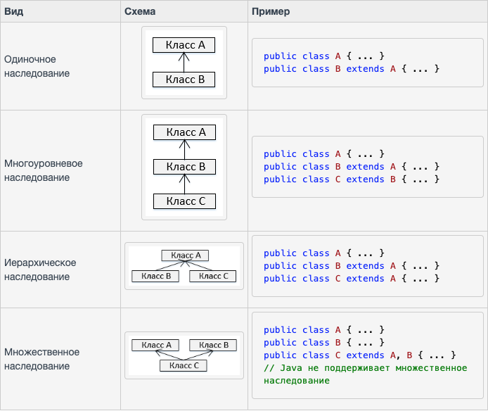

# Наследование

**Наследование** — это процесс перенимания классом свойств (методов и полей) другого класса.
С использованием наследования в Java, информация становится управляемой в иерархическом порядке.

Класс, который наследует свойства другого класса, называется подклассом (производным классом, наследующим классом),
а класс, свойства которого наследуются, известен как суперкласс (базовый класс, родительский класс)

Подкласс наследует все члены (поля, методы, вложенные классы) из суперкласса.

Конструкторы не являются членами, поэтому они не наследуются подклассом,
но конструктор суперкласса может быть вызван из подкласса.

---

### Виды наследования



Очень важно запомнить, что Java не поддерживает множественное наследование.
Это значит, что класс не может продлить более одного класса.
Значит, следующее утверждение **НЕВЕРНО**:

```java
public class Cyborg extends Animal, Human{
    
}
```

Тем не менее, класс может реализовать один или несколько интерфейсов,
что и помогло Java избавиться от невозможности множественного наследования.

---

### Ключевое слово extends

**extends** — это кодовое слово, используемое для наследования свойств класса.
Взглянем на синтаксис этого ключевого слова.

```java
class Super {

}
class Sub extends Super {

}
```

---

### Ключевое слово super

Ключевое слово **super** схоже с ключевым словом **this**. Ниже приведены случаи, где используется **super** в Java.

- Для **дифференциации членов** суперкласса от членов подкласса, если у них есть одинаковые имена.
- Для **вызова конструктора суперкласса** из подкласса.

```java
class Super_class {
   int num = 88;

   public void display() {
      System.out.println("Это метод display() суперкласса");
   }
}

public class Sub_class extends Super_class {
   int num = 77;

   public void display() {
      System.out.println("Это метод display() подкласса");
   }

   public void doSomething() {
      display(); // метод display() подкласса

      super.display(); // метод display() суперкласса

      System.out.println("Значение переменной num в подклассе: " + num); // значение переменной num подкласса

      System.out.println("Значение переменной num в суперклассе: " + super.num); // значение переменной num суперкласса
   }

   public static void main(String args[]) {
      Sub_class obj = new Sub_class();
      obj.doSomething();
   }
}
```

---

### Вызов конструктора суперкласса

Если класс перенимает свойства другого класса, подкласс автоматически вызывает стандартный конструктор суперкласса `super()`.
Но если нужно вызвать параметризованный конструктор суперкласса, нужно использовать ключевое слово super, как показано ниже

```java
super(values);
```

```java
class Superclass {
   int age;

   Superclass(int age) {
      this.age = age; 		 
   }

   public void getAge() {
      System.out.println("Значение переменной age в суперклассе равно: " + age);
   }
}

public class Subclass extends Superclass {
   Subclass(int age) {
      super(age);
   }

   public static void main(String args[]) {
      Subclass s = new Subclass(24);
      s.getAge();
   }
}
```

---

### [Назад к оглавлению](./README.md)