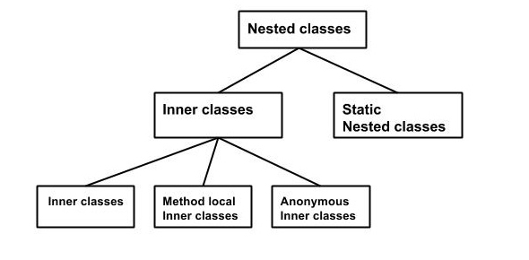

# Вложенные классы (nested classes)

---

### Вложенные классы

В Java, подобно методам, переменные класса тоже могут иметь в качестве своего члена другой класс.
В Java допускается написание класса внутри другого.

Класс, написанный внутри класса, называется в Java вложенным (nested) классом.  
Класс, который содержит внутренний класс, называется внешним (outer) классом.

```java
class OuterClass {

    class NestedClass {

    }
    
    static class StaticNestedClass {
    
    }
}
```

Вложенные классы в Java делятся на два типа:

-   нестатические вложенные классы (**non-static nested classes** или **inner classes**)
-   статические вложенные классы (**static nested classes**)

---

### Иерархия вложенных классов



В зависимости от того, как и где определены внутренние классы (**inner classes**), классы делятся на 3 типа:
-   внутренние классы (**inner classes**)
-   локальные классы (**method local classes**)
-   анонимные классы (**anonymous classes**)

**Внутренние классы** — это механизм безопасности в Java.
Класс не может быть связан с модификатором доступа private, но если класс является как член другого класса,
то внутренний класс может быть **private**.
Это также используется для доступа к закрытым (private) членам класса.

---

### Особенности внутренних классов

-   модификаторы доступа для внутренних классов работают так же, как и для переменных
-   внутренний класс не может содержать статические переменные и методы
-   объект внутреннего класса не может существовать без объекта внешнего класса
-   к переменным внешнего класса есть доступ у объекта внутреннего класса  
-   в статическом методах внешнего класса нельзя использовать объект внутреннего класса 

---

### [Назад к оглавлению](./README.md)