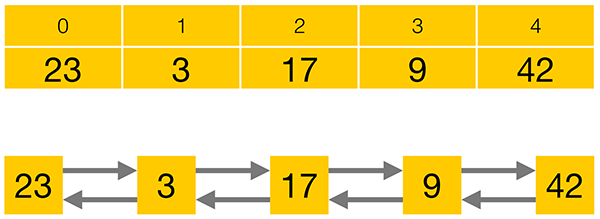
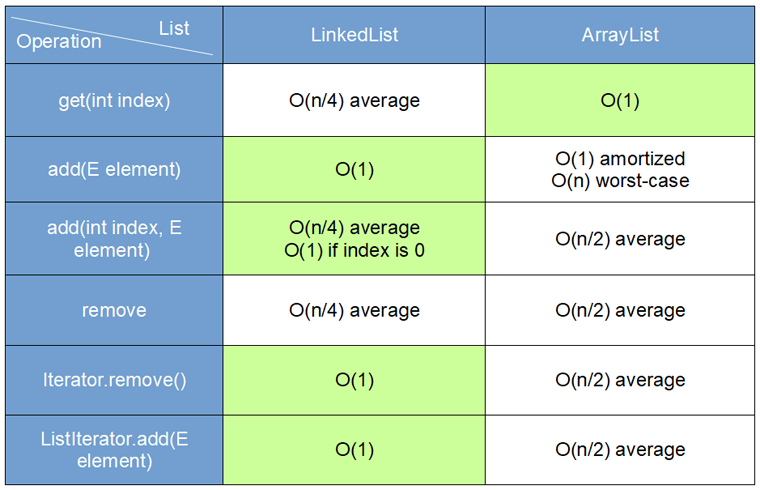

# ArrayList vs LinkedList

`ArrayList` - это список на основе массива.
`LinkedList` - связанный список на основе элементов и связи между ними.
В качестве `LinkedList` лучше всего подходит представление вагонов поезда сцепленных последовательно.

`ArrayList` следует использовать, когда в приоритете доступ по индексу,
так как эти операции выполняются за константное время.
Добавление в конец списка в среднем тоже выполняется за константное время.
Кроме того в `ArrayList` нет дополнительных расходов на хранение связки между элементами.
Минусы в скорости вставки/удаления элементов находящихся не в конце списка,
так как при этой операции все элементы правее добавляемого/удаляемого сдвигаются.

`LinkedList` удобен когда важнее быстродействие операций вставки/удаления,
которые в `LinkedList` выполняются за константное время.
Операции доступа по индексу производятся перебором с начала или конца (смотря что ближе) до нужного элемента.
Дополнительные затраты на хранение связки между элементами.

Одним словом - если часто вставляете/удаляете - выбирайте в пользу `LinkedList`, в противном случае `ArrayList`

---

### Сложность операций

Чтобы оценить эти структуры данных, можно прибегнуть к сложности выполнения операций

---

### add()

|                      | ArrayList | LinkedList 
|----------------------|-----------|------------
| add (в начало)       | O(n)      | O(1)
| add (в середину)     | O(n)      | O(n)
| add (в конец списка) | O(n)      | O(1)   

В `LinkedList` вставка осуществляется так: находится элемент, за которым должен следовать вставляемый элемент,
изменяются ссылки в нем и следующим за ним.

В `ArrayList` создается новый массив, если в текущем нет места.
Те элементы которые находятся до вставляемого, остаются на месте, или копируются в новый.
Далее добавляется вставляемый элемент.
Затем копируются оставшиеся элементы, которые были в исходном.

---

### get()

|                      | ArrayList | LinkedList 
|----------------------|-----------|------------
| get (в начало)       | O(1)      | O(1)
| get (в середину)     | O(1)      | O(n)
| get (в конец списка) | O(1)      | O(1)   

В `LinkedList` чтобы найти элемент с нужным индексом,
нужно пройтись поочередно по ссылкам от первого элемента и до последнего (в худшем случае).

В `ArrayList` получения элемента происходит простым взятием по индексу из массива.

---

### delete()

|                         | ArrayList | LinkedList 
|-------------------------|-----------|------------
| delete (в начало)       | O(n)      | O(1)
| delete (в середину)     | O(n)      | O(n)
| delete (в конец списка) | O(1)      | O(1)   

В `LinkedList` удаление происходит аналогично вставке. 

В `ArrayList`, примерно, так же как и при добавлении.

Как мы видим в среднем, сложности одинаковые. Но не рекомендовано использовать `LinkedList`,
за исключением ситуации когда, преобладает удаление или вставка в начало или конец списка.

---
   
При выборе `ArrayList` в качестве имплементации списка следует понимать,
что операция добавления элементов может вызвать необходимость увеличения размера массива,
что приведет к операции копирования всех элементов из одного массива в другой.
В связи с этим следует обращать внимание на первоначальную вместимость,
которая может быть указана в конструкторе при создании списка public `ArrayList(int initialCapacity)`.

Если вы не можете оценить предполагаемое кол-во элементов которые будут храниться в коллекции и
для вас нет необходимости в доступе к элементам по индексу то лучше обратить внимание на `LinkedList`.

`ArrayList` более предсказуем для процессора, с точки зрения расположения данных.
Это массив, а там элементы расположены последовательно, занимая непрырывную область памяти.
Это хорошо, так как позволяет подгружать данные в кэши процессора без cache miss'ов.
Процессор не простаивает, ожидая данные из оперативной памяти.
С `LinkedList` такого нет, т.к. элементы располагаются в разных участках памяти,
и предугадать расположение следующего элемента процессору не под силам.

Понимать чем отличаются различные типы коллекций действительно важно,
но на практике для большинства прикладных задач, где речь идет о десятках и сотнях элементов,
выбор конкретной имплементации коллекции не играет большой роли как в отношении производительности,
так и в отношении используемой памяти.

---

### [Назад к оглавлению](./README.md)