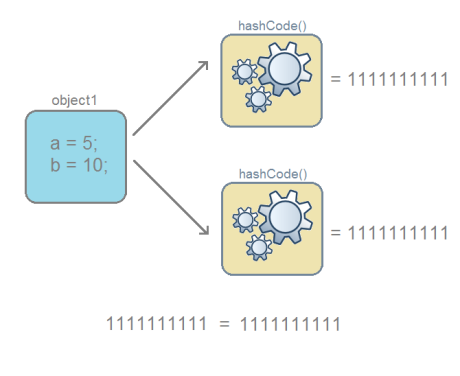
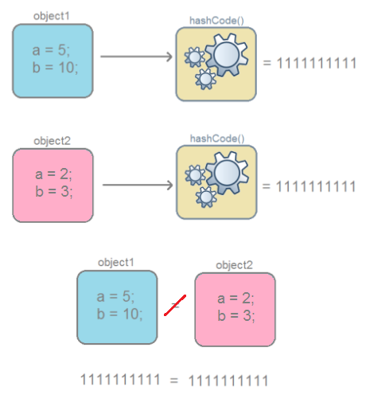
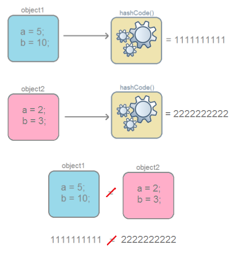
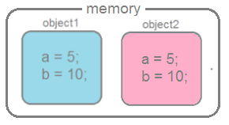
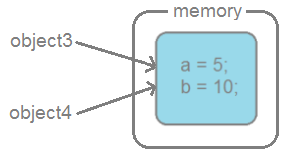

# equals() и hashCode()

---

### Что такое hashCode?

Если очень просто, то хеш-код — это число.
Если более точно, то это битовая строка фиксированной длины,
полученная из массива произвольной длины ([wiki](https://ru.wikipedia.org/wiki/Хеш-функция))

В java она представлена в виде числа примитивного типа int, который равен 4-м байтам, и может помещать числа от -2 147 483 648 до 2 147 483 647.
На данном этапе важно понимать, что `hashCode` это число, у которого есть свой предел, который для java ограничен примитивным целочисленным типом **int**.

hashCode — это целочисленный результат работы метода, которому в качестве входного параметра передан объект. 

Этот метод реализован таким образом, что для одного и того-же входного объекта, `hashCode` всегда будет одинаковым.
Следует понимать, что множество возможных `hashCode` ограничено примитивным типом **int**, а множество объектов ничем не ограничено.

Следует: `Множество объектов больше множества hashCode`

Из-за этого ограничения, вполне возможна ситуация, что `hashCode` разных объектов могут совпасть. 

Главное понять, что:

- Если `hashCode` разные, то и входные объекты гарантированно разные.
- Если `hashCode` равны, то входные объекты не всегда равны.

Ситуация, когда у разных объектов одинаковые hashCode называется — коллизией (collision).
Вероятность возникновения коллизии зависит от используемого алгоритма генерации hashCode.

---

### Вывод

`Одинаковые объекты` — это объекты одного класса с одинаковым содержимым полей

-   для одного и того-же объекта, `hashCode` всегда будет **одинаковым**
    

-   если объекты **одинаковые**, то и `hashCode` **одинаковые** (но не наоборот)
    
    
-   если `hashCode` **равны**, то входные объекты **не всегда равны** (коллизия)
    
    
-   если `hashCode` **разные**, то и объекты гарантированно **разные**
    

---

### Понятие эквивалентности. Метод equals()

В java, каждый вызов оператора new порождает новый объект в памяти.

```java
public class TestClass {
	int a;
	int b;
	
	BlackBox(int a, int b){
		this.a = a;
		this.b = b;
	}
    
	public static void main(String[] args) {
		TestClass object1 = new TestClass(5, 10);
		TestClass object2 = new TestClass(5, 10);
	}
}
```

в памяти создастся два объекта.




Но, как вы уже обратили внимание, содержимое этих объектов одинаково, то есть эквивалентно. Для проверки эквивалентности в классе Object существует метод equals(), который сравнивает содержимое объектов и выводит значение типа boolean true, если содержимое эквивалентно, и false — если нет.

```java
object1.equals(object2);    // должно быть true
```

Equals и hashcode тесно связанны между собой, поскольку hashcode вычисляется на основании содержимого объекта (значения полей)
и если у двух объектов одного и того же класса содержимое одинаковое, то и hashcode должны быть одинаковые

```java
object1.equals(object2);                    // должно быть true
object1.hashCode() == object2.hashCode()    // должно быть true
```

Если вы выполнить предыдущий пример, то на самом деле результатом выполнения всех операций будет false.
Для пояснения причин, заглянем в исходные коды класса Object.

---

### Класс Object

Как известно, все java-классы наследуются от класса **Object**.
В этом классе уже определены методы `hashCode()` и `equals()`.

Определяя свой класс, вы автоматически наследуете все методы класса **Object**.
В ситуации, когда в вашем классе не переопределены (@overriding) `hashCode()` и `equals()`, то используется их реализация из **Object**.

Исходный код метода `equals()` в классе Object

```java
public boolean equals(Object obj) {
    return (this == obj);
}
```

При сравнение объектов, операция `==` вернет **true** лишь в одном случае — когда ссылки указывают на один и тот-же объект.
В данном случае не учитывается содержимое полей.

```java
public class TestClass {
	int a;
	int b;
	
	BlackBox(int a, int b){
		this.a = a;
		this.b = b;
	}
    
	public static void main(String[] args) {
		TestClass object3 = new с(5, 10);
		TestClass object4 = object3;
	}
}
```



`Object.equals()` работает не так как нужно, потому что он сравнивает ссылки, а не содержимое объектов.

`hashCode()` тоже работает не так как полагается.

исходный код метода `hashCode()` в классе **Object**

```java
public native int hashCode();
```


Это вся реализация.
Ключевое слово **native** означает, что реализация данного метода выполнена на другом языке, например на C, C++ или ассемблере.
Конкретный `native int hashCode()` реализован на C++.
Исходники — функция [get_next_hash](http://hg.openjdk.java.net/jdk7/jdk7/hotspot/file/tip/src/share/vm/runtime/synchronizer.cpp)

При вычислении `hashCode` для объектов класса **Object** по умолчанию используется **Park-Miller RNG** алгоритм.
В основу работы данного алгоритма положен генератор случайных чисел.
Это означает, что при каждом запуске программы у объекта будет разный hashCode.

Используя реализацию метода `hashCode()` от класса **Object**, при каждом создании объекта класса,
`hashCode()` будет возвращать разные значения.
Мало того, перезапуская программу, будем возвращаться абсолютно разные значения, поскольку это просто случайное число.

Но должно выполняться правило:

`если у двух объектов одного и того же класса содержимое одинаковое, то и hashCode должны быть одинаковые`

Поэтому, при создании пользовательского класса, принято переопределять методы `hashCode()` и `equals()` таким образом, что бы учитывались поля объекта.
Это можно сделать вручную либо воспользовавшись средствами генерации исходного кода в IDE

Итоговый класс TestClass

```java
public class TestClass {
	int a;
	int b;
	
	TestClass(int a, int b){
		this.a = a;
		this.b = b;
	}

	@Override
	public int hashCode() {
		int result = 1;
		result = 31 * result + a;
		result = 31 * result + b;
		return result;
	}

	@Override
	public boolean equals(Object obj) {
		if (this == obj)
	    	return true;
        
        return obj instanceof TestClass &&
                a == ((TestClass) obj).a &&
                b == ((TestClass) obj).b;
	}
}
```

Теперь методы `hashCode()` и `equals()` работают корректно и учитывают содержимое полей объекта:

```java
object1.equals(object2);                  //true
object1.hashCode() == object2.hashCode(); //true
```

В заключении, создавая пользовательский класс, нужно переопределять методы `hashCode()` и `equals()`,
что бы они корректно работали и учитывали данные объекта.
Кроме того, если оставить реализацию из **Object**, то при использовании **java.util.HashMap** возникнут проблемы,
поскольку **HashMap** активно используют `hashCode()` и `equals()` в своей работе

---

### [Назад к оглавлению](./README.md)