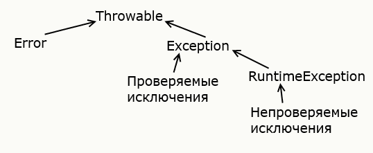

# Классы исключений

Базовым классом для всех исключений является класс **Throwable**.
От него уже наследуются два класса: 

-   **Error**
-   **Exception**

Все остальные классы являются производными от этих двух классов.

Класс **Error** описывает внутренние ошибки в исполняющей среде Java.
У программиста очень ограниченные возможности для обработки подобных ошибок.

Исключения наследуются от класса Exception.
Среди этих исключений следует выделить класс **RuntimeException**.
**RuntimeException** является базовым классом для так называемой группы непроверяемых исключений (_unchecked exceptions_) -
компилятор не проверяет факт обработки таких исключений и их можно не указывать вместе с оператором `throws` в объявлении метода.
Такие исключения являются следствием ошибок разработчика, например, неверное преобразование типов или выход за пределы массива.

Примеры классов непроверяемых исключений:

-   `ArithmeticException` исключение, возникающее при делении на ноль
-   `IndexOutOfBoundException` индекс вне границ массива
-   `IllegalArgumentException` использование неверного аргумента при вызове метода
-   `NullPointerException` использование пустой ссылки
-   `NumberFormatException` ошибка преобразования строки в число

Все остальные классы, образованные от класса **Exception**, называются проверяемыми исключениями (_checked exceptions_).

Примеры классов проверяемых исключений:

-   `CloneNotSupportedException` класс, для объекта которого вызывается клонирование, не реализует интерфейс Clonable
-   `InterruptedException` поток прерван другим потоком
-   `ClassNotFoundException` невозможно найти класс

Подобные исключения обрабатываются с помощью конструкции `try..catch`.
Либо можно передать обработку методу, который будет вызывать данный метод, указав исключения после оператора `throws`

```java
public Person clone() throws CloneNotSupportedException {
    Person p = (Person) super.clone();
    return p;
}
```

Общая схема иерархии исключений



Расширенная схема иерархии исключений:


Поскольку все классы исключений наследуются от класса **Exception**,
то все они наследуют ряд его методов,которые позволяют получить информацию о характере исключения.
Среди этих методов отметим наиболее важные:

-   `getMessage()` возвращает сообщение об исключении
-   `getStackTrace()` возвращает массив, содержащий трассировку стека исключения
-   `printStackTrace()` отображает трассировку стека

```java
try {
    int x = 6/0;
} catch(Exception e) {
    e.printStackTrace();
}
```

---

### [Назад к оглавлению](./README.md)