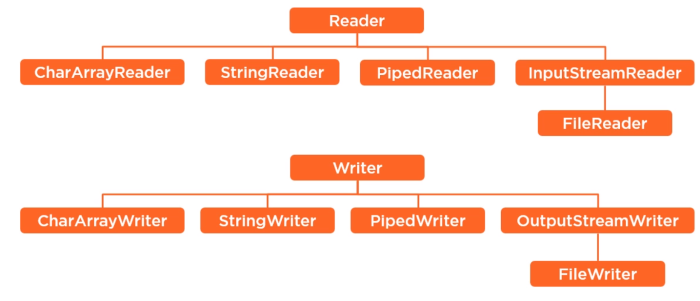

# Потоки ввода-вывода

Пакет **java.io** содержит почти каждый класс, который может потребоваться для совершения ввода и вывода в Java.
Все данные потоки представлены потоком ввода и адресом вывода.
Поток в пакете **java.io** осуществляет поддержку различных данных, таких как примитивы, объекты, локализованные символы и т.д.

Потоки в Java определяются в качестве последовательности данных.
Существует два типа потоков:

- `InputStream` поток ввода - используется для считывания данных с источника.
- `OutputStream` поток вывода - используется для записи данных по месту назначения.

Java предоставляет сильную, но гибкую поддержку в отношении ввода/вывода, связанных с файлами и сетями,
однако в данном руководстве рассмотрены лишь базовые функции, связанные с потоками и вводом/выводом.
Рассмотрим далее по порядку наиболее распространенные примеры.

---

### Байтовый поток

Потоки байтов в Java используются для осуществления ввода и вывода 8-битных байтов.
Не смотря на множество классов, связанных с потоками байтов, наиболее распространено использование следующих классов:
`FileInputStream` и `FileOutputStream`.

Рассмотрим пример, иллюстрирующий использование данных двух классов для копирования из одного файла в другой.
Чтобы скопировать файл, необходимо в папке проекта создать файл **file.txt** с любым или пустым содержимым.

```java
import java.io.*;
public class FileCopy {

   public static void main(String args[]) throws IOException {  
      FileInputStream fileIn = null;
      FileOutputStream fileOut = null;

      try {
         fileIn = new FileInputStream("file.txt");
         fileOut = new FileOutputStream("new_file.txt");
         
         int a;
         // Копирование содержимого файла file.txt
         while ((a = fileIn.read()) != -1) {
         // Чтение содержимого файла file.txt и запись в файл new_file.txt
            fileOut.write(a); 
         }
      } finally {
         if (fileIn != null) {
            fileIn.close();
         }
         if (fileOut != null) {
            fileOut.close();
         }
      }
   }
}
```

---

# Символьный поток

Но поскольку работать с байтами не очень удобно, то для работы с потоками символов были добавлены абстрактные классы **Reader**
(для чтения потоков символов) и **Writer** (для записи потоков символов). Потоки байтов в Java позволяют произвести ввод и вывод 8-битных байтов,
в то время как потоки символов используются для ввода и вывода 16-битного юникода.

Не смотря на множество классов, связанных с потоками символов, наиболее распространено использование следующих классов: `FileReader` и `FileWriter`.
Не смотря на тот факт, что внутренний `FileReader` использует **FileInputStream**, и `FileWriter` использует **FileOutputStream**,
основное различие состоит в том, что `FileReader` производит считывание двух байтов в конкретный момент времени,
в то время как `FileWriter` производит запись двух байтов за то же время.

Рассмотрим пример, иллюстрирующий использование данных двух классов для копирования из одного файла в другой с символами юникода.
Чтобы скопировать файл, необходимо в папке проекта создать файл **file.txt** с любым или пустым содержимым.

```java
import java.io.*;
public class FileCopy {

   public static void main(String args[]) throws IOException {
      FileReader fileIn = null;
      FileWriter fileOut = null;

      try {
         fileIn = new FileReader("file.txt");
         fileOut = new FileWriter("new_file.txt");
         
         int a;
         while ((a = fileIn.read()) != -1) {
            fileOut.write(a);
         }
      } finally {
         if (fileIn != null) {
            fileIn.close();
         }
         if (fileOut != null) {
            fileOut.close();
         }
      }
   }
}
```

### Стандартный поток

Все языки программирования обеспечивают поддержку стандартного ввода/вывода,
где программа пользователя может произвести ввод посредством клавиатуры и осуществить вывод на экран компьютера.
Если вы знакомы с языками программирования C либо C++, вам должны быть известны три стандартных устройства **STDIN**, **STDOUT** и **STDERR**.
Аналогичным образом, Java предоставляет следующие три стандартных потока:

-   `Стандартный ввод` используется для перевода данных в программу пользователя,
    клавиатура обычно используется в качестве стандартного потока ввода, представленного в виде System.in.
-   `Стандартный вывод` производится для вывода данных, полученных в программе пользователя,
    и обычно экран компьютера используется в качестве стандартного потока вывода, представленного в виде System.out.
-   `Стандартная ошибка` используется для вывода данных об ошибке, полученной в программе пользователя,
    чаще всего экран компьютера служит в качестве стандартного потока сообщений об ошибках, представленного в виде System.err.

Ниже представлена простая программа, которая создает `InputStreamReader` для чтения стандартного потока ввода, до введения пользователем `q`:

```java
import java.io.*;
public class ReadConsole {

   public static void main(String args[]) throws IOException {
      InputStreamReader inStRe = null;

      try {
         inStRe = new InputStreamReader(System.in);
         System.out.println("Input symbols, symbol 'q' for exit.");
         char a;
         do {
            a = (char) inStRe.read();
            System.out.print(a);
         } while(a != 'q');
      }finally {
         if (inStRe != null) {
            inStRe.close();
         }
      }
   }
}
```

---

### Чтение и запись файла

Как было указано выше, поток представляет собой последовательность данных.
InputStream используется для считывания данных с источника, OutputStream служит для записи данных по месту назначения.


Иерархия классов для управления байтовыми потоками ввода и вывода.


Иерархия классов для управления символьными потоками ввода и вывода.



---

### [Назад к оглавлению](./README.md)