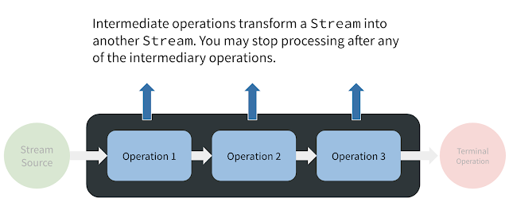

# Stream API. Промежуточные операции (Intermediate operations)

Промежуточные операции действуют как декларативное (функциональное) описание того,
как элементы **Stream** должны быть преобразованы.
В совокупности они образуют конвейер, через который будут проходить элементы.
То, что выходит в конце линии, естественно, зависит от того, как спроектирована эта система

В отличие от механического конвейера, промежуточная операция в конвейере потока может визуализировать новый поток,
который может зависеть от элементов предыдущих этапов.
В случае операции `map()`, новый Stream может даже содержать элементы другого типа.

---

### операции

-   [`Stream<T> takeWhile​(Predicate<? super T> predicate)`](./stream_api_drop_take_while.md#takewhile)
    выбирает из потока элементы, пока они соответствуют условию в predicate.
    Выбранные элементы возвращаются в виде потока
-   [`Stream<T> dropWhile​(Predicate<? super T> predicate)`](./stream_api_drop_take_while.md#dropwhile)
    пропускает элементы, которые соответствуют условию в predicate, пока не попадется элемент, который не соответствует условию.
    Выбранные элементы возвращаются в виде потока
-   [`Stream<T> distinct()`](./stream_api_drop_take_while.md#distinct)
    возвращает поток, в котором имеются только уникальные данные с типом `T`
-   [`Stream<T> filter(Predicate<? super T> predicate)`](./stream_api_filter.md)
    фильтрует элементы в соответствии с условием в предикате
-   [`Stream<T> sorted()`](./stream_api_sorted.md)
    возвращает отсортированный поток
-   [`Stream<T> sorted(Comparator<? super T> comparator)`](./stream_api_sorted.md)
    возвращает отсортированный в соответствии с компаратором поток
-   [`<R> Stream<R> map(Function<? super T,? extends R> mapper)`](./stream_api_map.md)
    преобразует элементы типа `T` в элементы типа `R` и возвращает поток с элементами `R`
-   [`<R> Stream<R> flatMap(Function<? super T, ? extends Stream<? extends R>> mapper)`](./stream_api_flatmap.md)
    позволяет преобразовать элемент типа `T`
    в несколько элементов типа `R` и возвращает поток с элементами `R`
-   [`Stream<T> limit(long maxSize)`](./stream_api_skip_limit.md)
    оставляет в потоке только maxSize элементов
-   [`Stream<T> skip(long n)`](./stream_api_skip_limit.md)
    возвращает поток, в котором отсутствуют первые n элементов
-   [`Stream<T> concat​(Stream<? extends T> a, Stream<? extends T> b)`](./stream_api_concat.md)
    объединяет два потока

---

### [Назад к оглавлению](../../README.md)