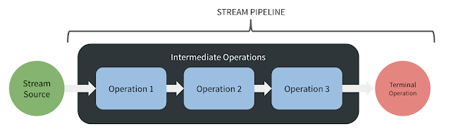

# Stream API
   
Начиная с JDK 8 в Java появился новый API - **Stream API**.
Его задача - упростить работу с наборами данных, в частности, упростить операции фильтрации, сортировки и другие манипуляции с данными.
Вся основная функциональность данного API сосредоточена в пакете _java.util.stream_.

Ключевым понятием в Stream API является поток данных.
Вообще сам термин **поток** довольно перегружен в программировании в целом и в Java в частности.
Применительно к **Stream API** поток представляет канал передачи данных из источника данных.
Причем в качестве источника могут выступать как файлы, так и массивы и коллекции.

Одной из отличительных черт Stream API является применение `лямбда-выражений`, которые позволяют значительно сократить запись выполняемых действий.

При ближайшем рассмотрении мы можем найти в других технологиях программирования аналоги подобного API.
В частности, в языке C# некоторым аналогом **Stream API** будет технология **LINQ**.

Рассмотрим примере как можно использовать **Stream API**.
Допустим, у нас есть задача: найти в массиве количество всех чисел, которые больше 0.
До JDK 8 мы бы могли написать что-то наподобие следующего:

```java
int[] numbers = { -5, -4, -3, -2, -1, 0, 1, 2, 3, 4, 5 };
int count = 0;
for(int i: numbers) {
    if(i > 0) {
        count++;
    }
}
System.out.println(count);
```

Решение этой же задачи с помощью **Stream API**

```java
import java.util.stream.*;

long count = IntStream.of(-5, -4, -3, -2, -1, 0, 1, 2, 3, 4, 5)
                .filter(w -> w > 0)
                .count();

System.out.println(count);
```

Теперь вместо цикла и кучи условных конструкций, которые использовались до JDK 8,
можно записать цепочку методов, которые будут выполнять те же действия.

При работе со Stream API важно понимать, что все операции с потоками делятся на два типа:

-   [промежуточные](./intermediate/stream_api_intermediate_operations.md) (**intermediate** operations)
-   [терминальные](./terminal/stream_api_terminal_operations.md) (**terminal** operations)

**Промежуточные** операции возвращают трансформированный поток.
Например, выше в примере метод `filter()` принимал поток чисел и возвращал уже преобразованный поток, в котором только числа больше 0.
К возвращенному потоку также можно применить ряд промежуточных операций.

**Терминальные** или конечные операции возвращают конкретный результат.
Например, в примере выше метод `count()` представляет терминальную операцию и возвращает число.
После этого никаких промежуточных операций естественно **применять нельзя!!!**

Все потоки производят вычисления, в том числе в промежуточных операциях,
только тогда, когда к ним применяется терминальная операция.
То есть в данном случае применяется отложенное выполнение.



В основе Stream API лежит интерфейс `BaseStream`. Его полное определение `interface BaseStream<T , S extends BaseStream<T , S>>`
Здесь параметр `T` означает тип данных в потоке, а `S` - тип потока, который наследуется от интерфейса _BaseStream_.

_BaseStream_ определяет базовый функционал для работы с потоками, которые реализуется через его методы:

-   `void close()` закрывает поток
-   `boolean isParallel()` возвращает true, если поток является параллельным
-   `Iterator<Т> iterator()` возвращает ссылку на итератор потока
-   `Spliterator<Т> spliterator()` возвращает ссылку на сплитератор потока
-   `S parallel()` возвращает параллельный поток (параллельные потоки могут задействовать несколько ядер процессора в многоядерных архитектурах)
-   `S sequential()` возвращает последовательный поток
-   `S unordered()` возвращает неупорядоченный поток

От интерфейса BaseStream наследуется ряд интерфейсов, предназначенных для создания конкретных потоков:

-   `Stream<T>` используется для потоков данных, представляющих любой ссылочный тип
-   `IntStream` используется для потоков с типом данных **int**
-   `DoubleStream` используется для потоков с типом данных **double**
-   `LongStream` используется для потоков с типом данных **long**

При работе с потоками, которые представляют определенный примитивный тип - _double_, _int_, _long_ проще использовать
интерфейсы **DoubleStream**, **IntStream**, **LongStream**.
Но в большинстве случаев, как правило, работа происходит с более сложными данными, для которых предназначен интерфейс Stream<T>.

---

Несмотря на то, что все эти операции позволяют взаимодействовать с потоком как неким набором данных наподобие коллекции,
важно понимать отличие коллекций от потоков:

-   Потоки не хранят элементы.
    Элементы, используемые в потоках, могут храниться в коллекции, либо при необходимости могут быть напрямую сгенерированы.
-   Операции с потоками не изменяют источника данных.
    Операции с потоками лишь возвращают новый поток с результатами этих операций.
-   Для потоков характерно отложенное выполнение.
    То есть выполнение всех операций с потоком происходит лишь тогда,
    когда выполняется терминальная операция и возвращается конкретный результат, а не новый поток.

---

### [Назад к оглавлению](../README.md)