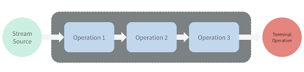

# Stream API. Терминальные операции (Terminal operations)

Терминальные операции позволяют произвести результат от оставшихся элементов (`count()`)
или побочный эффект (`forEach()`).

Поток не будет выполнять никаких вычислений над элементами источника, пока не начнется работа терминальной операции.
Это означает, что исходные элементы потребляются только по мере необходимости - разумный способ избежать ненужной работы.
Это также означает, что после применения терминальной операции поток становится использованным
и дальнейшие операции не могут быть применены к этому Stream объекту.

---

### операции

-   [`<R,A> R collect(Collector<? super T,A,R> collector)`](./stream_api_collect.md)
    добавляет элементы в неизменяемый контейнер с типом `R`.
    `T` представляет тип данных из вызывающего потока, а `A` - тип данных в контейнере
-   [`void forEach(Consumer<? super T> action)`](./stream_api_foreach.md)
    для каждого элемента выполняется действие _action_
-   [`long count()`](./stream_api_count.md)
    возвращает количество элементов в потоке
-   [`Optional<T> findFirst()`](./stream_api_find.md)
    возвращает первый элемент из потока
-   [`Optional<T> findAny()`](stream_api_find.md)
    возвращает первый попавшийся элемент из потока
-   [`boolean allMatch(Predicate<? super T> predicate)`](./stream_api_match.md)
    возвращает true, если все элементы потока удовлетворяют условию в предикате
-   [`boolean anyMatch(Predicate<? super T> predicate)`](./stream_api_match.md)
    возвращает true, если хоть один элемент потока удовлетворяют условию в предикате
-   [`boolean noneMatch(Predicate<? super T> predicate)`](./stream_api_match.md)
    возвращает true, если ни один из элементов в потоке не удовлетворяет условию в предикате
-   [`Optional<T> max(Comparator<? super T> comparator)`](./stream_api_min_max.md)
    возвращает максимальный элемент из потока.
    Для сравнения элементов применяется компаратор _comparator_
-   [`Optional<T> min(Comparator<? super T> comparator)`](./stream_api_min_max.md)
    возвращает минимальный элемент из потока.
    Для сравнения элементов применяется компаратор _comparator_
-   `Object[] toArray()` возвращает массив из элементов потока
    
---

### [Назад к оглавлению](../../README.md)