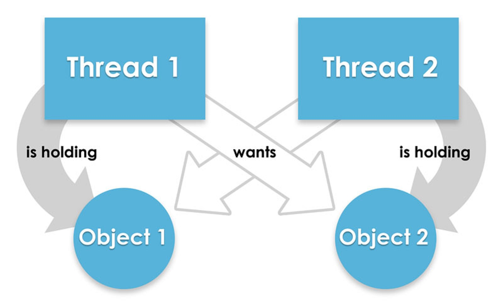

# Взаимная блокировка

В многопользовательских системах процесс находится в состоянии тупика, если он ожидает некоторого события, которое никогда не произойдет.

**Системная тупиковая ситуация** - когда один или более процессов оказываются в состоянии тупика.

С тупиком связана проблема - "бесконечное откладывание" - когда процесс, даже не находящийся в состоянии тупика,
ожидает события, которое может никогда не произойти из-за "необъективных" принципов, заложенных в системе планирования ресурсов.



---

### НЕОБХОДИМЫЕ УСЛОВИЯ ВОЗНИКНОВЕНИЯ ТУПИКОВЫХ СИТУАЦИЙ

-   `Условие взаимоисключения` процессы требуют предоставления им права монопольного управления ресурсами,
    которые им предоставляются
-   `Условие ожидания ресурсов` процессы удерживают за собой ресурсы, выделенные им,
    в то же время ожидают выделения дополнительных ресурсов
-   `Условия неперераспределенности` ресурсы нельзя отобрать у процесса, удерживающего их,
    пока эти ресурсы не будут использованы для завершения работы
-   `Условие кругового ожидания` существует кольцевая цепь процессов, в которой каждый процесс удерживает за собой один или более ресурсов,
    требующихся следующему процессу цепи

---

### Пример DeadLock ситуации 

```java
public class DeadLock {
    public void method1() {
        synchronized (String.class) {
            System.out.println("Lock on String.class object");
            synchronized (Integer.class) {
                System.out.println("Lock on Integer.class object");
            }
        }
    }
    public void method2() {
        synchronized (Integer.class) {
            System.out.println("Lock on Integer.class object");
            synchronized (String.class) {
                System.out.println("Lock on String.class object");
            }
        }
    }
}
```

Метод `method1()` запрашивает 2 лока, сначала **String** и затем **Integer**.
Метод `method2()` тоже запрашивает 2 лока, но в другом порядки сначала **Integer** и затем **String**.
Эта ситуация создает потенциальный deadlock если один из потоков будет удерживать лок на **String**, а другой - на **Integer**.
Оба потока будут ожидать вечно

---

### Пример исправления DeadLock ситуации

```java
public class DeadLockFixed {
    public void method1() {
        synchronized (Integer.class) {
            System.out.println("Lock on Integer.class object");
            synchronized (String.class) {
                System.out.println("Lock on String.class object");
            }
        }
    }
    public void method2() {
        synchronized (Integer.class) {
            System.out.println("Lock on Integer.class object");
            synchronized (String.class) {
                System.out.println("Lock on String.class object");
            }
        }
    }
}
```

Исправленная версия, которая позволяет избежать тупиковых ситуаций, используя циклическое ожидание без выгрузки.
Это одно из четырех условий, необходимых для DeadLock.

---

### [Назад к оглавлению](./README.md)