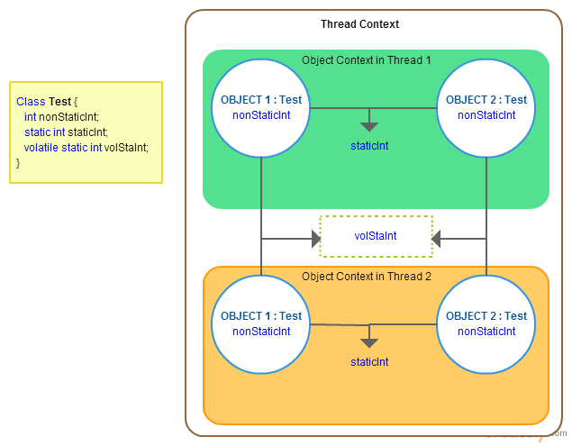

# Volatile переменные

Лишь половина всех разработчиков Java знает, что в Java есть ключевое слово **volatile**.
Из них лишь около 10 процентов знают, что оно значит, и еще меньше знают, как эффективно его использовать.
Определение переменной с ключевым словом **volatile**(«изменчивый») означает,
что значение переменной будет изменяться разными потоками.
Чтобы полностью понять, что значит **volatile** - нужно понять, как потоки оперируют с обычными, _не-volatile_, переменными.

В целях повышения эффективности работы, спецификации языка Java позволяет JRE сохранять локальную копию переменной в каждом потоке,
который ссылается на нее.
Можно считать эти «внутрипоточные» копии переменных похожими на кэш,
помогающий избежать проверки главной памяти каждый раз, когда требуется доступ к значению переменной.

Но представьте, что произойдёт в следующем случае:
запустятся два потока, и первый прочитает переменную А как 5, тогда как второй – как 10.
Если переменная А изменились от 5 до 10, то первый поток не будет знать об изменении, так что будет иметь неправильное значение А.
Однако если переменная А будет помечена как **volatile**, то в любое время, когда поток обращается к её значению,
он будет получать копию А и считывать её текущее значение.

Если переменные в вашем приложении не меняются, то внутрипоточный кэш имеет смысл.
В противном случае, очень полезно знать, что может сделать для вас ключевое слово **volatile**.

Если переменная объявлена как **volatile**, это означает, что она может изменяться разными потоками.
Естественно ожидать, что JRE обеспечит ту или иную форму синхронизации таких **volatile**-переменных.
JRE действительно неявно обеспечивает синхронизацию при доступе к **volatile**-переменным, но с одной очень большой оговоркой:
чтение **volatile**-переменной и запись в **volatile**-переменную синхронизированы, а неатомарные операции ― нет.

Это означает, что следующий код не является потокобезопасным: `volatileVar++;`

Предыдущий оператор можно записать и так:

```java
int temp = 0;
synchronize(volatileVar) {
  temp = volatileVar;
}
temp++;
synchronize(volatileVar) {
  volatileVar = temp;
}
```

Другими словами, если **volatile**-переменная обновляется таким образом,
что ее значение считывается, изменяется, и ей "под капотом" присваивается новое значение,
то результатом будет непотокобезопасная операция, выполняемая между двумя синхронными операциями.
Остается решить, использовать ли явную синхронизацию или же полагаться на поддержку
автоматической синхронизации **volatile**-переменных в JRE.
Наилучший подход зависит от обстоятельств: если новое значение **volatile**-переменной зависит от ее текущего значения
(как при операции инкремента), то нужна явная синхронизация, чтобы эта операция была потокобезопасной.

---

### Схема хранения данных в Java



---

### [Назад к оглавлению](./README.md)