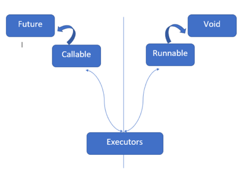

# Асинхронность с Future

Если нам нужен результат вычисления, выполняемого в другом потоке, чем `main`, то нужно воспользоваться интерфейсом `Callable`.

Ответ от задачи недоступен немедленно, и в качестве альтернативы `Callable` вернет будущий объект `Future`, когда он будет отправлен в службу выполнения.
Этот объект обещает, что, когда вычисления завершатся, мы получим их результат — достаточно только вызвать `get()`.

Это не очень хорошее применение асинхронности, так как `get()` блокирует текущий поток до тех пор, пока не получит ответ.
Однако существует обходной путь через метод `future.isDone()` — он постоянно проверяет, завершено ли вычисление, и только когда этот метод вернет значение **true**, `get()` возвратит результат.



Пример:

```java
public class AsyncFuture {

    public Callable<Integer> getFibonacci(int n) {
        Callable<Integer> callable = () -> {
            switch (n) {
                case 1:
                    return 0;
                case 2:
                    return 1;
                default:
                    int a = 0;
                    int b = 1;
                    for (int i = 2; i < n; i++) {
                        int c = a + b;
                        a = b;
                        b = c;
                    }
                    return 0;
            }
        };
        return callable;
    }

    public static void main(String[] args) {
        ExecutorService service = Executors.newSingleThreadExecutor();
        Future<Integer> submit = service.submit(getFibonacci(140));
        
        try {
            System.out.println(submit.get());
        } catch (Exception e) {
            e.printStackTrace();
        }
    }
}
```

---

### [Назад к оглавлению](./README.md)