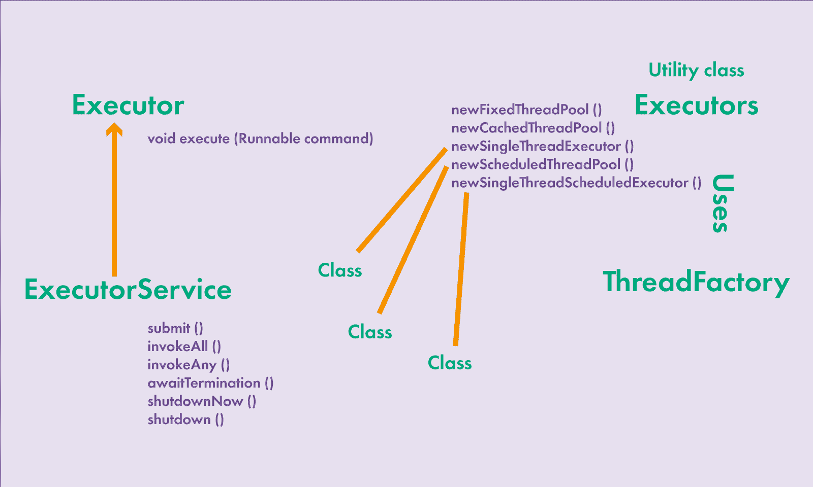

# Пул потоков

Создавать потоки для выполнения большого количества задач очень трудоемко: создание потока и освобождение ресурсов — дорогостоящие операции.
Для решения проблемы ввели пулы потоков.

Пул потоков — своего рода контейнер, в котором содержатся потоки, которые могут выполнять задачи, и после выполнения одной самостоятельно переходить к следующей.

Вторая причина создания пулов потоков — возможность разделить объект, выполняющий код, и непосредственно код задачи, которую необходимо выполнить.

Использование пула потоков обеспечивает лучший контроль создания потоков и экономит ресурсы создания потоков.

---

### [Назад к оглавлению](./README.md)