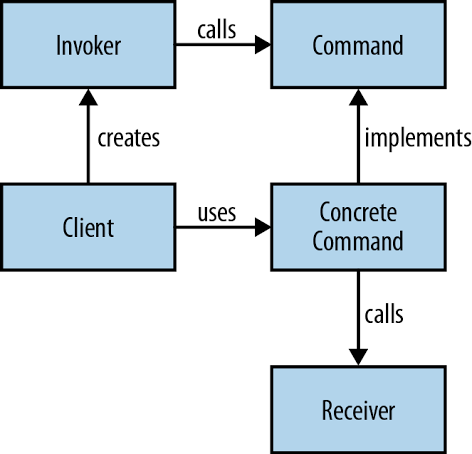

# Command

Необходимо иметь эффективное представление запросов к некоторой системе,
не обладая при этом знаниями ни об их природе ни о способах их обработки.

---

### Область применения

-   инкапсулирование запроса в виде объекта для последующего протоколирования/логирования и т.п.
-   наделение сущности “вызов метода объекта” свойствами самостоятельного объекта;
-   объектно-ориентированный обратный вызов (callback);



---

### Реализация

Command

```java
public interface Command { 
    void execute();
}
```

Concrete Command

```java
public class LightOnCommand implements Command {
    Light light;
    public LightOnCommand(Light light) {
        this.light = light;
    }
    public void execute() {
        light.switchOn();
    }
}

public class LightOffCommand implements Command {
    Light light;
    public LightOffCommand(Light light) {
        this.light = light;
    }
    public void execute() {
        light.switchOff();
    }
}
```

Receiver

```java
public class Light {
    private boolean on;
    public void switchOn() {
        on = true;
    }
    public void switchOff() {
        on = false;
    }
}
```

Invoker

```java
public class RemoteControl {
    private Command command;
    public void setCommand(Command command) {
        this.command = command;
    }
    public void pressButton() {
        command.execute();
    }
}
```

Client

```java
public class Client {
    public static void main(String[] args) {
        RemoteControl control = new RemoteControl();
        Light light = new Light();
        Command lightsOn = new LightsOnCommand(light);
        Command lightsOff = new LightsOffCommand(light);
        //switch on
        control.setCommand(lightsOn);
        control.pressButton();
        //switch off
        control.setCommand(lightsOff);
        control.pressButton();
    }
}
```

---

### [Назад к оглавлению](./README.md)