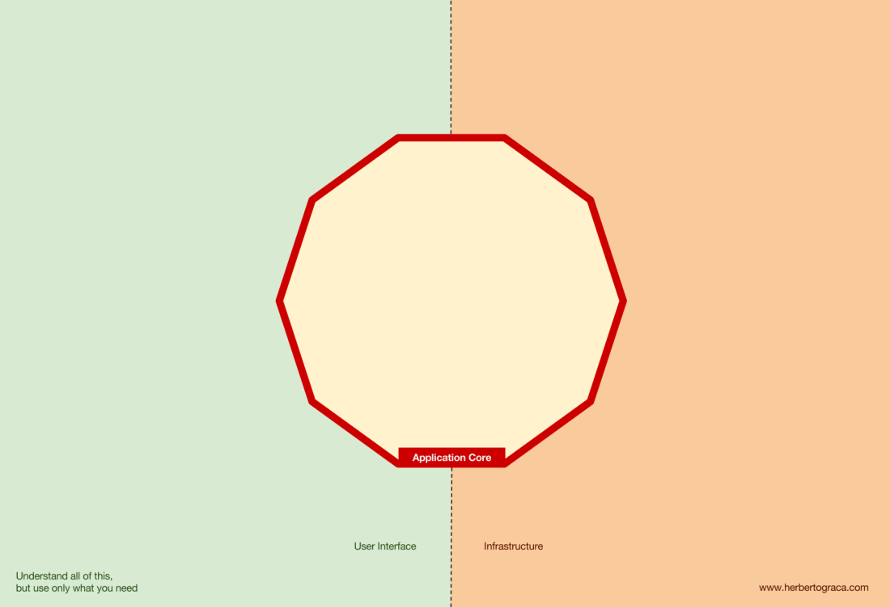
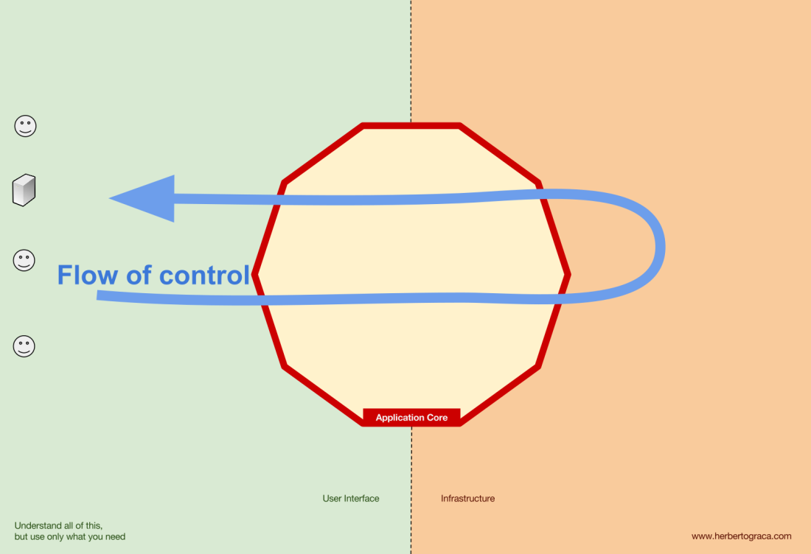
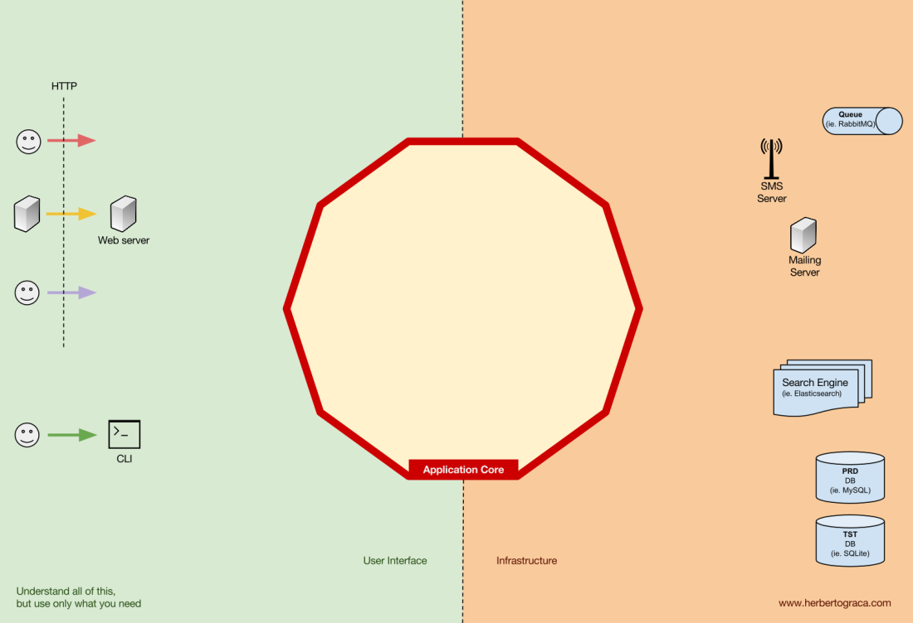
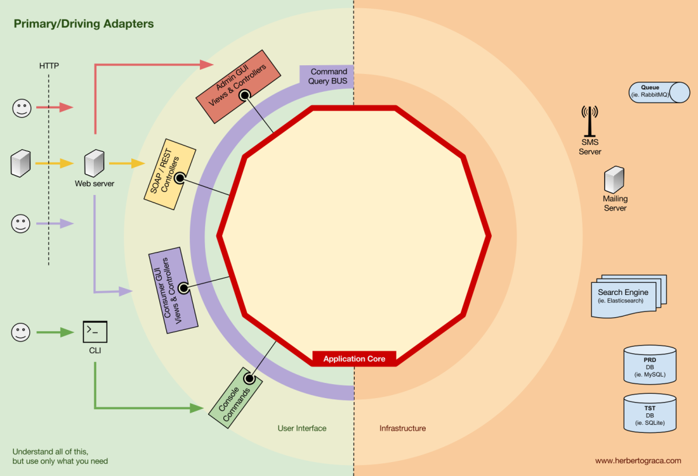
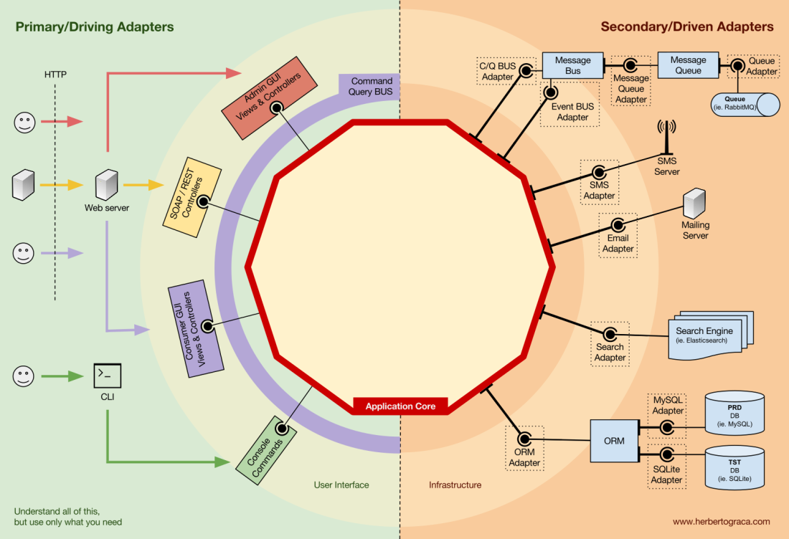
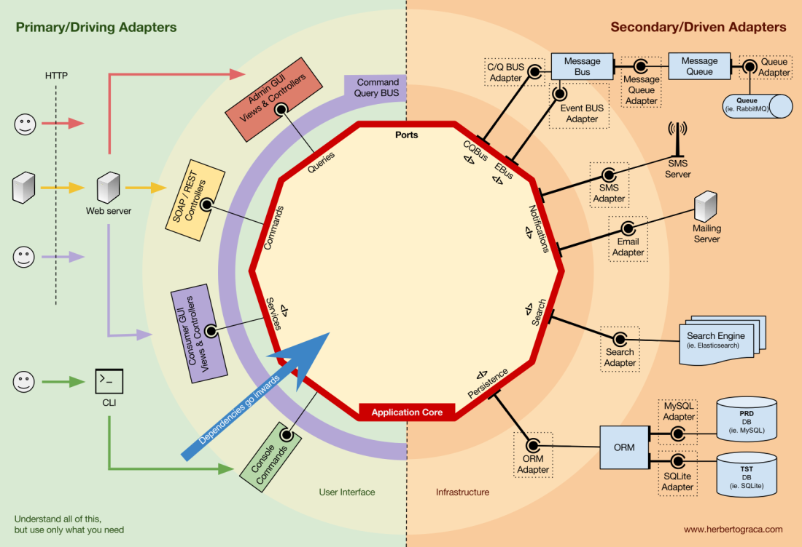
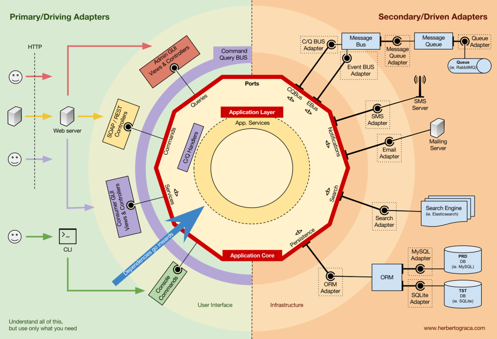
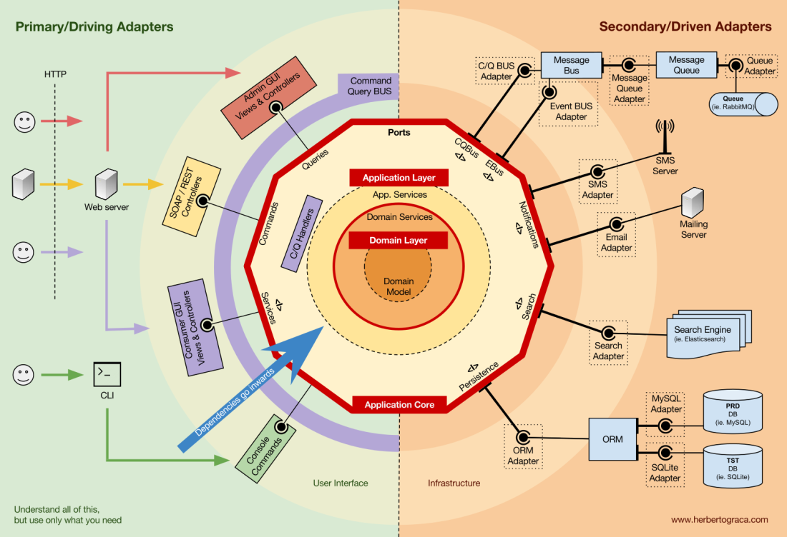
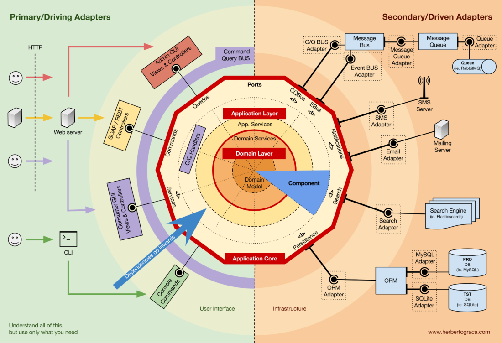
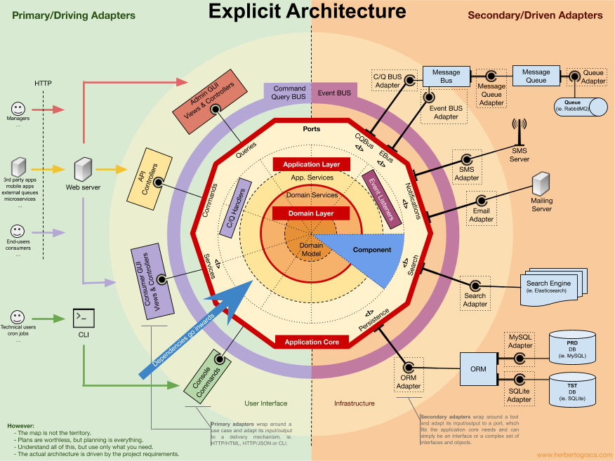

# Explicit architecture

Материал взят из данной [статьи](https://herbertograca.com/2017/11/16/explicit-architecture-01-ddd-hexagonal-onion-clean-cqrs-how-i-put-it-all-together/) 

---

### Fundamental blocks of the system

---

### Tools

---

### Connecting the tools and delivery mechanisms to the Application Core

---

### Secondary or Driven Adapters

---

### Inversion of control

---

### Application Core organisation

---

### Domain Layer

---

### [Назад к оглавлению](../README.md)