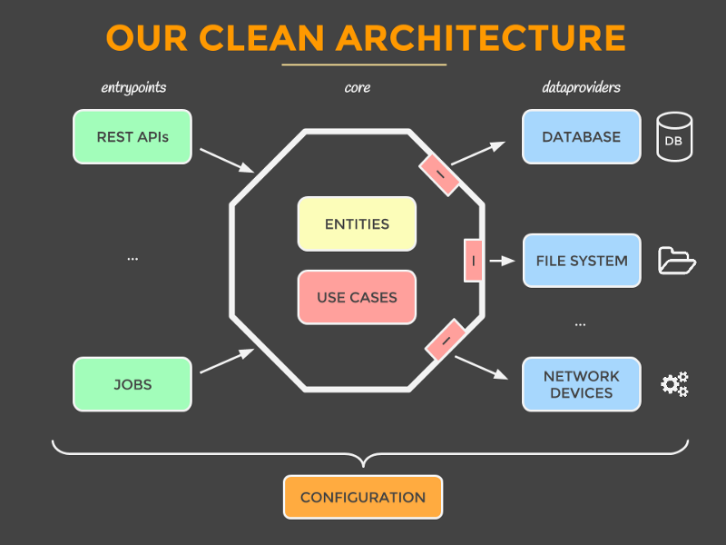
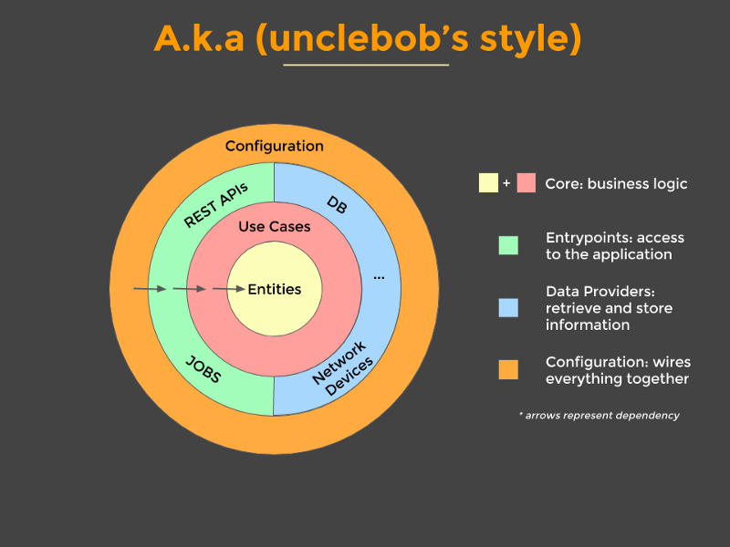

# SOLID

Чтобы понять, правильно ли написан класс, можно свериться со "стандартами качества".
В Java это так называемые принципы **S.O.L.I.D.**

**SOLID** — это акроним, образованный из заглавных букв первых пяти принципов ООП и проектирования.
Принципы придумал Роберт Мартин в начале двухтысячных, а аббревиатуру позже ввел в обиход Майкл Фэзерс.

-   `Single Responsibility Principle` **SRP** Принцип единственной ответственности
-   `Open Closed Principle` **OCP** Принцип открытости/закрытости
-   `Liskov’s Substitution Principle` **LSP** Принцип подстановки Барбары Лисков
-   `Interface Segregation Principle` **ISP** Принцип разделения интерфейса
-   `Dependency Inversion Principle` **DIP** Принцип инверсии зависимостей

---

### SRP: Принцип единственной ответственности 

_**A module should be responsible to one, and only one, actor.**_

На каждом проекте люди играют разные роли.
В этом принципе речь идет о том, что изменения в модуле может запрашивать одна и только одна роль.

```java
// bad example
public class Car {
        public void drive() {
             stop();
        }
        public void stop() { }

        public void connectToDatabase() { }
}
// good example
public class Car {
    public void move() { }
    public void stop() { }
}

public class Connector {
    public void connectToDatabase() { }
}
```

---

### OCP: Принцип открытости/закрытости

_**A software artifact should be open for extension but closed for modification.**_

Открыт для расширения, закрыт для модификации.
Используя `dependency inversion`, модуль объявляет только интерфейс, но не реализацию.
Таким образом, логика приложения содержится в одном файле, а класс, реализующий интерфейс — в другом.

```java
public class Parser {
    // bad example
    public ContactResult parse(String text) { }
    // good example
    public Result parse(String text) { }
}
// good example
public class OwnParser extends Parser {

    public Result beforeParse(String text) { }

    public Result parse(String text) {
        beforeParse(text);
        Result result = super.parse(text);
        afterParse(result);
        return result;
    }

    public Result afterParse(String text) { }
}
```

---

### LSP: Принцип подстановки Барбары Лисков

_**Functions that use pointers or references to base classes must be able to use objects of derived classes without knowing it.**_

Класс потомок не должен менять поведение класса родителя, но может дополнять его.

```java
class Parent {
    public String getStatus() {
        return "OK";
    }
}

// bad example
class Child extends Parent {
    public String getStatus() {
        return "Successful"; // Not good
    }
}
// good example
class Child extends Parent {
    public String getStatus() {
        if (hasErrors()) {
            return "Failed";
        } else {
            return super.getStatus();
        }
    }
}
```

---

### ISP: Принцип разделения интерфейса

_**Make fine grained interfaces that are client specific.**_

Разделение интерфейса облегчает использование и тестирование модулей.

```java
// bad example
interface Generator {  
    void generateXML();
    void generatePDF();
    void generateCSV();
}
// good example
interface XMLGenerator {
    void generateXML();
}

interface PDFGenerator {
    void generatePDF();
}

interface CSVGenerator {
    void generateCSV();
}
```

---

### DIP: Принцип инверсии зависимостей

_**Depend on abstractions, not on concretions.**_

-   Модули верхних уровней не должны зависеть от модулей нижних уровней.
    Оба типа модулей должны зависеть от абстракций
-   Абстракции не должны зависеть от деталей.
    Детали должны зависеть от абстракций

```java
// bad example
public class Executor { 
    public void exec(String message) {
        MySQLConnection con = new MySQLConnection();
        SMTPEmailService emailService = new SMTPEmailService();
        
        con.save(message);
        emailService.send(message);
    }
}
// good example
public class Executor {
    
    private Connection con;
    private EmailService emailService;
    
    public Executor(Connection con, EmailService emailService) {
        this.con = con;
        this.emailService = emailService;
    }   

    public void exec(String message) {
        con.save(message);
        emailService.send(message);
    }
}
```

---

### Clean Architecture






---

### Книги по этой теме

[Clean Architecture: A Craftsman's Guide to Software Structure and Design](https://www.amazon.com/gp/product/0134494164/)

Описывает архитектуру, построенную из кирпичиков, удовлетворяющих SOLID принципам.
Дает определение структурному, объектно-ориентированному, функциональному программированию.
Содержит одно из лучших описаний SOLID принципов.

---

### [Назад к оглавлению](./README.md)
