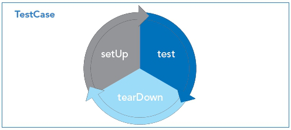

# Тестирование

Сегодня все большую популярность приобретает [test-driven development(TDD)](https://ru.wikipedia.org/wiki/Разработка_через_тестирование),
техника разработки ПО, при которой сначала пишется тест на определенный функционал, а затем пишется реализация этого функционала.
На практике все, конечно же, не настолько идеально, но в результате код не только написан и протестирован,
но тесты как бы неявно задают требования к функционалу, а также показывают пример использования этого функционала.

---

### Мифы тестирования:

-   У меня нет вермени на тесты
-   Тестирование – скучное и не творческое занятие
-   Мой код и так отлично работает
-   Это работа для отдела тестировани. У них получиться лучше

---

### Test Driven Development

1)  Пишем простейший тест, ломающий программу
2)  Пишем простейшую реализацию, достаточную для прохождения теста
3)  Улучшаем написанный код, не ломая тесты. Возвращаемся к пункту `1`

Техника довольно понятна, но встает вопрос, что использовать для написания этих самых тестов?

---

### Средства тестирования:

- Инфраструктуры для написания и запуска тестов Junit, TestNG
- Библиотеки проверок FEST, Assert, Hamcrest, XMLUnit, HttpUnit
- Библиотеки для создания тестовых дублеров Mockito, JMock, EasyMock


**JUnit** - самый известный и самый используемый фреймворк для тестирования. 

---

### Junit 
**JUnit** — библиотека для модульного тестирования программ Java.
**JUnit** принадлежит семье фреймворков xUnit для разных языков программирования, берущей начало в SUnit Кента Бека для Smalltalk.
**JUnit** породил экосистему расширений — JMock, EasyMock, DbUnit, HttpUnit и т.д.

Библиотека **JUnit** была портирована на другие языки, включая PHP (PHPUnit), C# (NUnit), Python (PyUnit), Fortran (fUnit),
Delphi (DUnit), Free Pascal (FPCUnit), Perl (Test::Unit), C++ (CPPUnit), Flex (FlexUnit), JavaScript (JSUnit)

**JUnit** – это Java фреймворк для тестирования, т. е. тестирования отдельных участков кода, например, методов или классов.
Опыт, полученный при работе с JUnit, важен в разработке концепций тестирования программного обеспечения.

Пример теста **JUnit**

```java
import org.junit.Test;
import junit.framework.Assert;
 
public class MathTest {
    @Test
    public void testEquals() {
        Assert.assertEquals(4, 2 + 2);
        Assert.assertTrue(4 == 2 + 2);
    }
 
    @Test
    public void testNotEquals() {
        Assert.assertFalse(5 == 2 + 2);
    }
}
```

---

### Необходимость использования JUnit

JUnit позволяет в любой момент быстро убедиться в работоспособности кода.
Если программа не является совсем простой и включает множество классов и методов,
то для её проверки может потребоваться значительное время.
Естественно, что данный процесс лучше автоматизировать.
Использование **JUnit** позволяет проверить код программы без значительных усилий и не занимает много времени.

**Юнит тесты** классов и функций являются своего рода документацией к тому, что ожидается в результате их выполнения.
И не просто документацией, а документацией которая может автоматически проверять код на соответствие предъявленным функциям.
Это удобно, и часто тесты разрабатывают как вместе, так и до реализации классов.
Разработка через тестирование — крайне популярная технология создания серьезного программного обеспечения.

---

### Виды тестирования и место JUnit тестирования в классификации

Тестирование программного обеспечение можно разделить на два вида:

-   тестирование черного ящика
-   тестирование белого ящика

Во время тестирования программы как черного ящика внутренняя структура приложения в расчет не принимается.
Все, что имеет значение, это функциональность, которую приложение должно обеспечить.
При тестировании программы как белого ящика во внимание принимается внутренняя структура, т.е. класс и методы.
Кроме этого, тестирование можно разделить на четыре уровня:

-   `модульное тестирование` тестирование отдельных модулей (классов, методов) - **unit tests**
-   `интеграционное тестирование` тестирование взаимодействия и совместной работы компонентов
-   `системное тестирование` тестирование всей системы как целого
-   `приемное тестирование` итоговое тестирование готовой системы на соответствие требованиям

Юнит тестирование по определению является тестированием белого ящика.

---

### Junit test lifecycle



---

### Аннотации Junit

-   `@BeforeClass` методы, которые будут вызваны до создания экземпляра тест-класса.
    Методы должны быть **public static void**.
    Данную аннотацию (метод) имеет смысл использовать для тестирования в случае, когда класс содержит несколько тестов,
    использующих различные предустановки, либо когда несколько тестов используют одни и те же данные, 
    чтобы не тратить время на их создание для каждого теста.
-   `@Before` методы, которые будут вызваны перед исполнением тестов.
    Методы должны быть **public void**. Здесь обычно размещаются предустановки для теста (генерация тестовых данных)
-   `@Test` сами тестовые методы - размещаются сами проверки.
    Методы должны быть **public void**.
    В данной аннотации можно использовать два параметра,
    **expected** — задает ожидаемое исключение и
    **timeout** — задает время, по истечению которого тест считается провалившимся.
-   `@After` методы, которые будут вызваны после выполнения тестов.
    Методы должны быть **public void**.
    Здесь размещаются операции освобождения ресурсов после теста (очистка тестовых данных)
-   `@AfterClass` выполняет методы после тестирования класса.
    Как и в случае с **@BeforeClass**, методы должны быть **public static void**.

---

### Правила тестирования. @Rule

JUnit позволяет использовать определенные разработчиком правила до и после выполнения теста, которые расширяют функционал.
Например, есть встроенные правила для задания таймаута для теста (Timeout),
для задания ожидаемых исключений (ExpectedException),
для работы с временными файлами(TemporaryFolder) и др.

Для объявления правила необходимо создать **public не static** поле типа производного от **MethodRule**
и аннотировать его с помощью ключевого слова `Rule`:

```java
public class JUnitTestDemo {

    @Rule
    public final ExpectedException expected = ExpectedException.none();

    @Rule
    public final TemporaryFolder folder = new TemporaryFolder();

    @Rule
    public final Timeout timeout = new Timeout(1000);
    
    @Test
    public void infinityLoop() {
        while (true);
    }

    @Test
    public void testFileWriting() throws IOException {
        final File log = folder.newFile("debug.log");
        final FileWriter logWriter = new FileWriter(log);
        logWriter.append("Hello, ");
        logWriter.append("World!!!");
        logWriter.flush();
        logWriter.close();
    }

    @Test
    public void testExpectedException() throws IOException {
        expected.expect(NullPointerException.class);
        String s1 = null;
        String s2 = "";
        s1.equals(s2);
    }
}
```
Можно указать правила и в самой аннотации

```java
@Test(expected = NullPointerException.class, timeout = 100)
```

Чтобы исключить тест нужно использовать аннотацию `@Ignore`

---

### Наборы тестов, JUnit Suite, SuiteClasses

Запуск теста может быть сконфигурирован с помощью аннотации `@RunWith`.
Тестовые классы, которые содержат в себе тестовые методы, можно объединить в наборы тестов (**Suite**).
Например, создано два класса тестирования объектов. Эти два тестовых класса можно объединить в один тестовый класс:

```java
import org.junit.runner.RunWith;
import org.junit.runners.Suite;

@RunWith(Suite.class)
@Suite.SuiteClasses ({
    TestFilter.class,
    TestConnect.class
})

public class TestConnections { }
```

Для настройки запускаемых тестов используется аннотация @SuiteClasses, в которую включены тестовые классы.

---

### Аннотация @Parameterized

Аннотация **Parameterized** позволяет использовать параметризированные тесты.
Для этого в тест-классе объявляется статический метод, возвращающий список данных,
которые будут использованы в качестве аргументов конструктора класса.

```java
import org.junit.Test;
import org.junit.runner.RunWith;
import org.junit.runners.Parameterized;

import java.util.Arrays;
import java.util.List;


import static org.junit.Assert.assertEquals;

@RunWith(Parameterized.class)
public class JUnitTestDemo {

    private CharSequence testData;
    private boolean expected;

    public JUnitTestDemo(CharSequence testData, boolean expected) {
        this.testData = testData;
        this.expected = expected;
    }

    @Test
    public void testIsEmpty () {
        final boolean actual = testData == null || testData.length() == 0;
        assertEquals(expected, actual);
    }

    @Parameterized.Parameters
    public static List<Object[]> init() {
        return Arrays.asList(new Object[][] {
                { null, true },
                { "", true },
                { " ", false },
                { "some string", false },
        });
    }
}
```

---

### Параметризирование метода : Theories.class, DataPoints, DataPoint, Theory

Аннотация **Theories** параметризирует тестовый метод, а не конструктор.
Данные помечаются с помощью `@DataPoints` и `@DataPoint`, тестовый метод — с помощью `@Theory`

```java
import org.junit.experimental.theories.DataPoint;
import org.junit.experimental.theories.DataPoints;
import org.junit.experimental.theories.Theories;
import org.junit.experimental.theories.Theory;
import org.junit.runner.RunWith;


import static org.junit.Assert.assertEquals;

@RunWith (Theories.class)
public class JUnitTestDemo {
    @DataPoints
    public static Object[][] isEmptyData = new Object[][] {
            { "", true },
            { " ", false },
            { "some string", false },
    };

    @DataPoint
    public static Object[] nullData = new Object[] { null, true };

    @Theory
    public void testEmpty(Object... testData) {
        final boolean actual = testData[0] == null || ((String) testData[0]).length() == 0;
        assertEquals(testData[1], actual);
    }
}
```

---

### Порядок выполнения тестов

Если необходимо выполнить тест в определенном порядке, то можно воспользоваться аннотацией `@FixMethodOrder(MethodSorters.NAME_ASCENDING)`

```java
@FixMethodOrder(MethodSorters.NAME_ASCENDING)
public class TestDemo {
    @Test 
	public void test01(){ }
    @Test 
	public void test02(){ }
    @Test 
	public void test09(){ }
}
```

---

### JUnit website [link](https://junit.org/junit5/)

---

### Мосk объекты

Мосk-объект имитирует поведение реального объекта заданным образом.
Мосk-объект может симулировать поведение бизнес-объектов и бизнес-логику,
что иногда необходимо из-за сложности реального поведения

-   EasyMock
-   Jmock
-   Mockito
-   MockLib
-   Mockrunner

---

### Mockito конфигурация

Добавить зависимость в вашем модуле на

```xml
<dependency>
    <groupId>org.mockito</groupId>
    <artifactId>mockito-all</artifactId>
    <version>1.9.5</version>
</dependency>
```

---

### Использование Mock

Все статисечкие методу лежат в org.mockito.Mockito

Создание mock объекта

```java
UserService mock = mock(UserService.class);

```

Указывается, что 

```java
//при вызове метода create() с таким User, нужно вернуть объект savedUser
when(mock.create(new User("first name", "last name"))).thenReturn(savedUser);

//при вызове метода processMethod() co значением do вернуть value
when(mockedObject.processMethod("do")).thenReturn("value");

// вернуть value при вызове метода processMethod() co значением input
doReturn("value").when(mockedObject).processMethod("input");

// выбросить ошибку при вызове метода processMethod() co значением exception_param
doThrow(new Exception()).when(mockedObject).processMethod("exception_param");
```

---

### Сложная заглушка

```java
when(mock.create(new User("1","2"))).thenAnswer(new Answer<User>() {
    @Override
    public User answer(InvocationOnMock invocation) throws Throwable {
        User user = new User("first name", "last name");
        user.setId(2);
        return user;
    }
});
```

---

### Проверка количества вызовов

verify(mock, times(1)).create(user);
verify(mock, times(1)).getById(1);
verify(mock, never()).loadAll();
verifyNoMoreInteractions(mock);

---

### [Назад к оглавлению](./README.md)